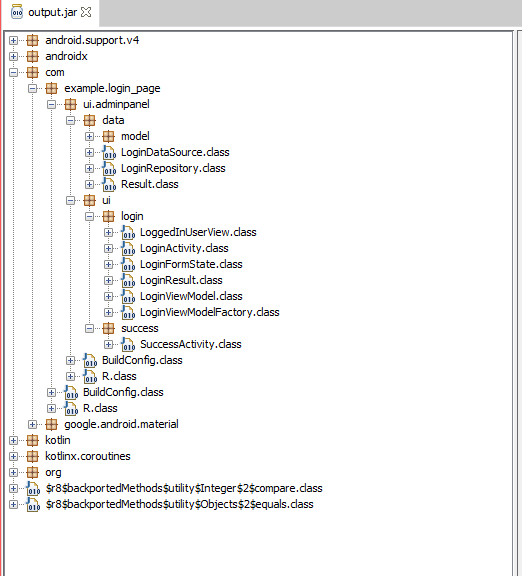
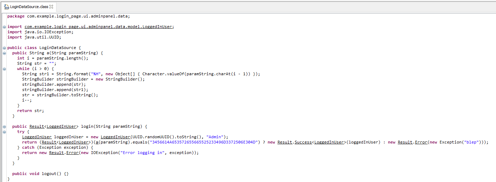
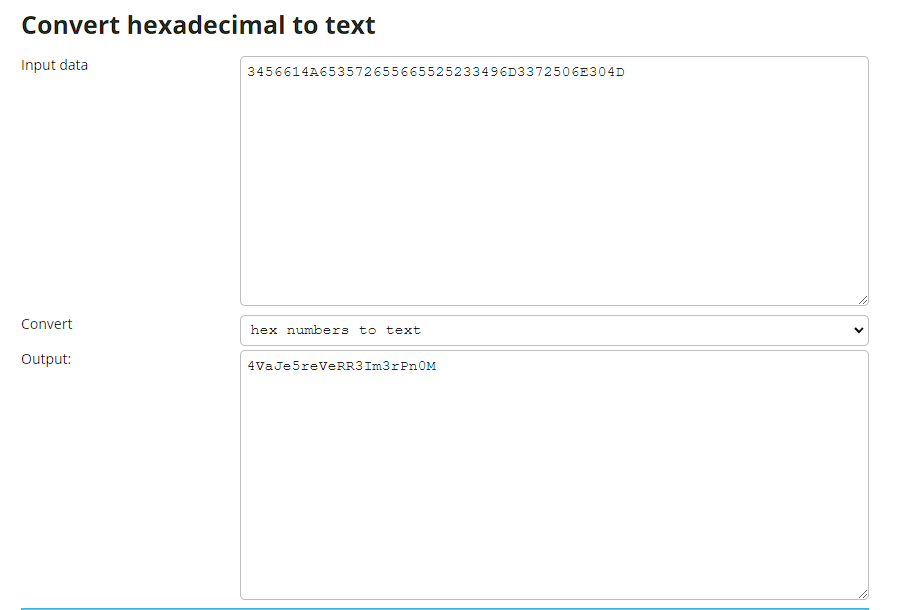

# **Admin_panel**.
## <u>**Catégorie**</u>

Android / Easy

## <u>**Description**</u> :

DESCRIPTION DU CHALL

Nous avons découvert une application suspecte sur le téléphone d'un espion. Trouver le moyen d'y accéder.

Format : MCTF{flag}

## <u>Hints</u> 

Indice 1 : Avez-vous déjà reverse une apk ? 
Indice 2 : Si seulement une classe avec la source des données existait...

## <u>Auteur</u> 

Arathor

## <u>Solution</u> :

On nous donne pour ce challenge une APK.

On sait d'ores et déjà qu'il s'agira de reverse sur ce challenge.

Il existe plusieurs moyen de reverse une apk, voici une des façon :

On peut accéder au code source simplement en utilisant le décompilateur d'Android studio qui ouvrira un projet contenant le code de l'APK, cependant les fichiers seront en .smali qui rend la lecture du code difficile. Cependant, Android studio est utile pour pouvoir lancer le projet et faire nos tests...

Pour ce faire nous allons utiliser dex2jar et jd-gui qui sont respectivement un convertisseur d'APK vers un fichier JAR et un décompileur java. 

Regrouper les fichiers dex2jar et l'APK dans le même dossier et depuis l'invite de commande saisissez la ligne suivant. 

        d2j-dex2jar.bat -f -o output.jar AdminPanel.apk

On a maintenant le code source de notre APK en jar, il suffit maintenant de les ouvrir dans jd-gui pour obtenir :

        

Rentrons dans le vif du sujet, nous avons une application qui s'ouvre sur une login page. 
Etant donné qu'il s'agit de reverse, vous devez vous balader dans le code, le comprendre et trouver un mot de passe dans celui-ci. 

Le fichier qui devrait tout de suite attirer votre attention est : LoginDataSource car il contient comme son nom l'indique la source des données de connexion. 

        

Elle contient 2 méthodes, une méthode login et une méthode a. 

La méthode a ne sert à rien elle est uniquement présente pour vous déstabiliser à essayer de la comprendre.

On comprend rapidement que la chaine qui va nous intéresser est celle dans login. 

        3456614A653572655665525233496D3372506E304D

La chaine est composée de chiffre de lettre. Il s'agit d'hexadécimal, après un rapide tour sur un convertisseur hexadécimal et quelques tests on obtient :

        

Malheureusement, il reste encore une étape car ce mot de passe ne fonctionne pas. Il faut pousser le reverse jusqu'au bout jusqu'à le prendre au mot. 

En effet retourner la chaine obtenue nous permet d'obtenir :

        M0nPr3mI3RReVer5eJaV4

Si on teste ce mot de passe, on obtient :

        

**Flag : MCTF{M0nPr3mI3RReVer5eJaV4}**