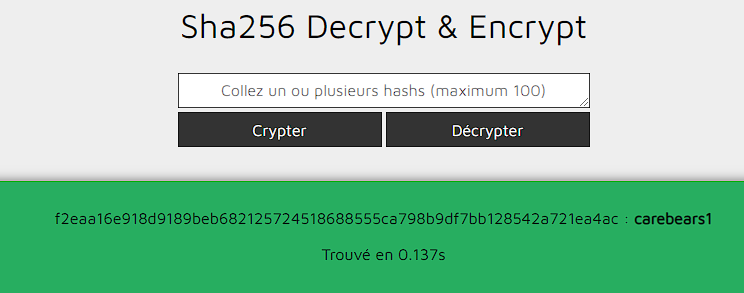

# **Weird_encryption**.
## <u>**Catégorie**</u>

Crypto / Easy

## <u>**Description**</u> :

DESCRIPTION DU CHALL

Nos agents ont reçu ce message incompréhensible. Faites ce qu'il faut pour le déchiffrer !

Format : MCTF{flag_en_clair}

## <u>Hints</u> 

Indice 1 : Ca serait bien de connaitre le type de chiffrement utilisé
Indice 2 : Savez-vous comment est composé un hash en SHA256 ?

## <u>Auteur</u> 

Arathor

## <u>Solution</u> :

La chaine de caractère que l'on obtient est identifiable très rapidement en utilisant dcode.fr

En effet, il s'agit de ROT47, qui est une variante de ROT13 qui est lui-même un cas particulier du chiffrage César. Là où ROT13 effectuera un décalage de 13 caractères de chaque lettre du texte à chiffer, ROT47 fera un décalage de 47.

Il suffit donc de déchiffrer le texte en ROT47 pour obtenir la chaine suivante :

"The ASCII  code  defines 94 printable characters,  so a rotat ion of half (94/2 = 47) makes it  poss ible to obtai n a symmetrical cipher, similar to ROT 3 (for the 26 letters of the alphabet). The flag i s MCTF{f2eaa16e918d9189beb682125724518688X555ca798b9df7bb128542a721ea4ac}"

On pourrait croire que c'est fini, cependant le flag est chiffré en SHA256.

Essayer de le déchiffrer tel quel et vous obtiendrez une erreur. 

Le chiffrement SHA256 est composé de 64 caractères hexadécimaux à savoir : 0123456789abcdef

MCTF{f2eaa16e918d9189beb682125724518688X555ca798b9df7bb128542a721ea4ac}

On peut voir qu'un X s'est glissé dans la chaine. X n'étant pas un caractère hexadécimal, nous avons trouvé l'intrus. 

        

**Flag : MCTF{carebears1}**
