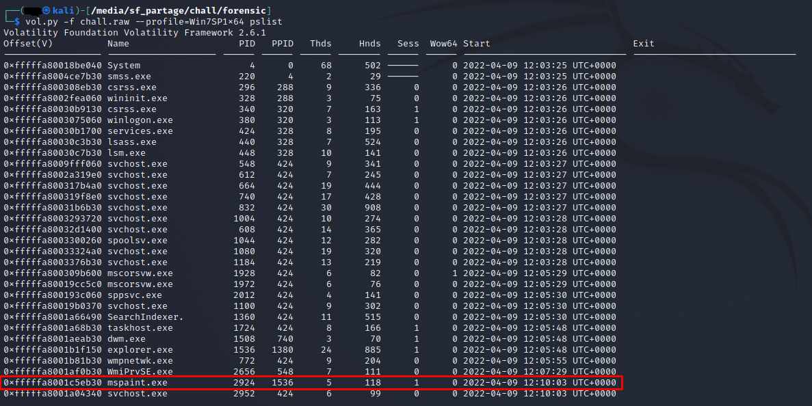
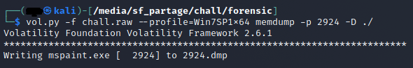
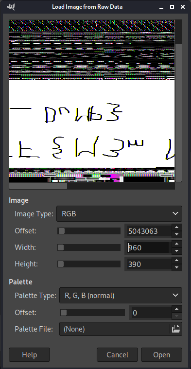
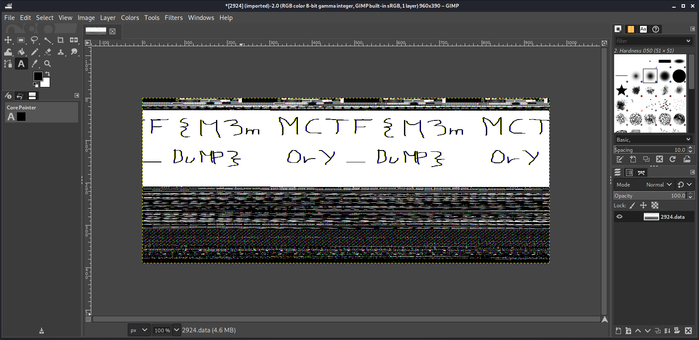

# **It remembers everything 2/3**
## <u>**Catégorie**</u>

Forensic / Facile

## <u>**Description**</u> :

Maintenant que l'utilisateur a été identifié, nous devons comprendre ce qu'il était en train de faire sur la machine avant notre arrivée.
Retrouvez le flag.

Format : MCTF{flag}

## <u>**Hints**</u> :

Indice 1 : Le processus "mspaint.exe" semble sortir du lot...

## <u>**Auteur**</u> :

x

## <u>Solution</u> :

On va commencer par lister les processus via la commande 
```
vol.py -f chall.raw --profile=Win7SP1x64 pslist
```



On remarque rapidement le processus "mspaint.exe" qui sort du lot

En prenant cette information en compte, on va venir dump le processus via la commande
```
vol.py -f chall.raw --profile=Win7SP1x64 memdump -p 2924 -D ./
```



Pour l'ouvrir dans GIMP ou un outil de traitement d'image similaire, on doit changer l'extension du fichier "2924.dmp" en "2924.data"

On peut désormais ouvrir ce fichier avec GIMP.

Lors de son ouverture, et ce à cause de la nature du fichier (données), il faut définir l'offset, la hauteur et la largeur.

En jouant un peu avec les différents paramètres, on arrive à un résultat qui semble correct (bien qu'à l'envers), on valide donc.



Ici, il ne nous reste plus qu'à retourner l'image via l'outil Tools -> Transform Tools -> Flip puis à cliquer sur l'image pour effectuer les modifications nécessaires.



On a désormais une image à l'endroit, ce qui nous permet d'obtenir le flag.

**Flag : MCTF{M3m0rY_DuMP}**