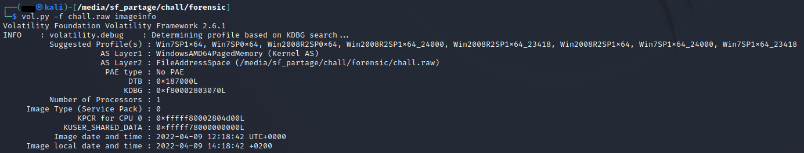
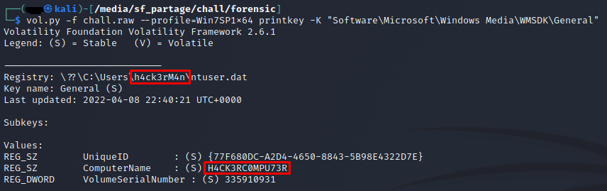

# **It remembers everything 1/3**
## <u>**Catégorie**</u>

Forensic / Facile

## <u>**Description**</u> :


Lors d'un raid sur un camp ennemi, nous avons tout juste eu le temps de dump la mémoire d'un ordinateur avant que celle-ci ne soit effacée. Malheureusement, nous n'avons aucune information sur la manière dont la machine était utilisée.
Retrouvez le nom de l'utilisateur ainsi que celui de la machine.

Format : MCTF{nomutilisateur:nommachine}

Dump : https://wormhole.app/Nm9RD#8jEuOOJL1ZHzaqj7OUvEfg

## <u>**Hints**</u> :

x

## <u>**Auteur**</u> :

x

## <u>Solution</u> :

Ce challenge nous sert d'introduction à la série de 3 challenges "It remembers everything".

On commence donc par ouvrir le dump avec volatility et chercher des infos sur l'image



On va utiliser le profil "Win7SP1x64" pour nos investigations.

Désormais, nous nous focalisons sur l'objectif : Trouver le nom de l'utilisateur ainsi que celui de la machine.

On va donc afficher la clé de registre qui contient ces informations via la commande 
```
vol.py -f chall.raw --profile=Win7SP1x64 printkey -K "Software\Microsoft\Windows Media\WMDSK\General"
```



On retrouve les informations recherchées. 

**Flag : MCTF{h4ck3rM4n:H4CK3RC0MPU73R}**
