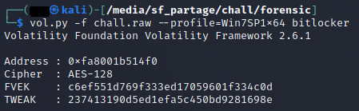
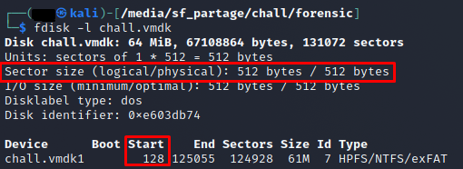
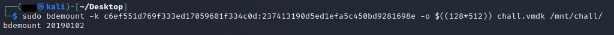
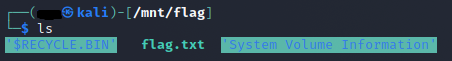
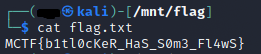

# **It remembers everything 3/3**
## <u>**Catégorie**</u>

Forensic / Facile

## <u>**Description**</u> :

Nous avons également trouvé un disque dur qui pourrait potentiellement contenir des informations importantes. Malheureusement, ce disque a été chiffré avec bitlocker.  
Débrouillez vous pour passer outre ce chiffrement et retrouvez le flag.

Format : MCTF{flag}

## <u>**Hints**</u> :

x

## <u>**Auteur**</u> :

x

## <u>Solution</u> :  

Volatility ne possédant pas nativement d'option bitlocker, on trouve malgré tout le plugin disponible sur github : https://github.com/elceef/bitlocker

On va devoir l'installer en placant bitlocker.py dans les plugins de volatility.

Le plugin installé, on va venir chercher des informations sur la clé bitlocker via la commande 
```
vol.py -f chall.raw --profile=Win7SP1x64 bitlocker
```



Désormais, il faut qu'on détermine le type de partition.

On va donc utiliser la commande 
```
fdisk -l chall.vmdk
```



Grâce à cette commande, on comprend que l'offset est 128 et que le disque a des secteurs de 512 bytes.

Maintenant qu'on a les informations nécessaires, on va pouvoir effectuer le déchiffrement du disque à la volée via la commande 

```
sudo bdemount -k c6ef551d769f333ed17059601f334c0d:237413190d5ed1efa5c450bd9281698e -o $((128*512)) chall.vmdk /mnt/disk/
```



Cette commande est composée de la façon suivante :  
- On indique les clés FVEK/TWEAK
- On indique l'offset ainsi que la composition des secteurs
- On indique le disque qu'on veut monter et où on veut le monter

On va désormais monter le disque précédemment déchiffré dans un dossier "flag" qu'on vient de créer pour le challenge via la commande 

```
sudo mount -o loop,ro /mnt/chall/bde1 /mnt/flag
```


On peut désormais observer les fichiers présents dans le disque dur



Il ne nous reste plus qu'à afficher le flag



**Flag : MCTF{b1tl0cKeR_HaS_S0m3_Fl4wS}**