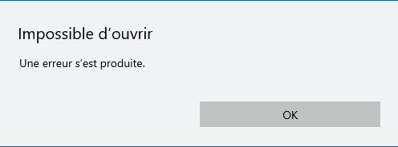
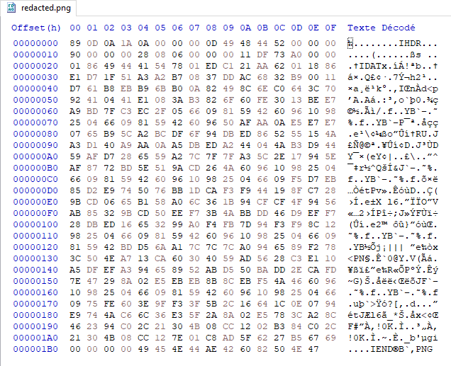
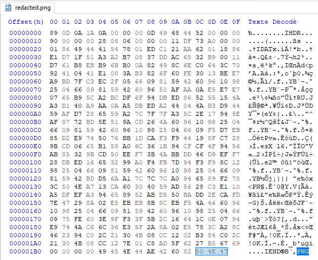
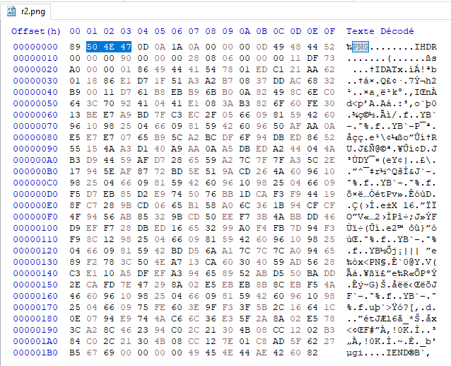
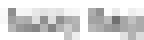
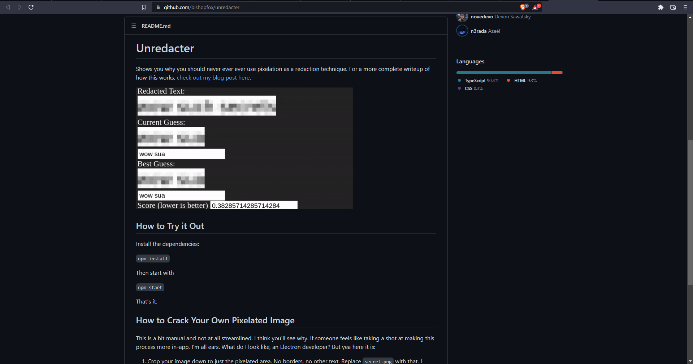
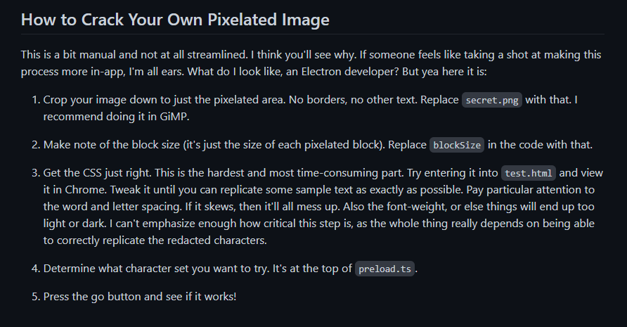
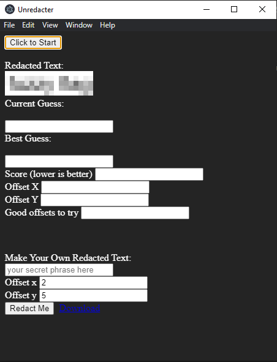
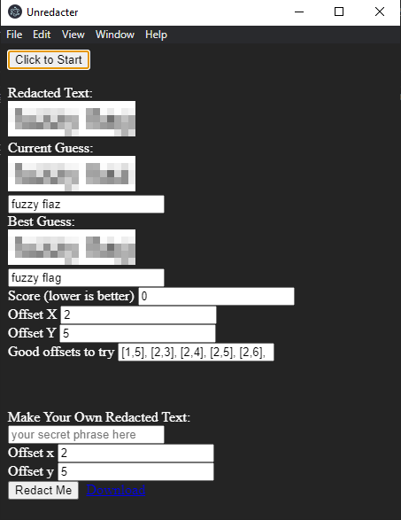

# **A blurred text is illegible**
## <u>**Catégorie**</u>

Misc / Facile

## <u>**Description**</u> :

En fouillant les fichiers ennemis, nous venons de tomber sur une image pixelisée, qui, semble-t-il, renferme un mot de passe...
Essayez de récupérer le texte pixellisé depuis cette image.

Format : MCTF{letextedépixellisé}

## <u>**Hints**</u> :

Indice 1 : Un grand journal cyber a récemment publié un article très intéressent sur un nouvel outil permettant de récupérer un texte pixellisé...

## <u>**Auteur**</u> :

x

## <u>Solution</u> :

À la réception de l'image, on remarque très rapidement qu'il est impossible de l'ouvrir. 

Après avoir vérifié l'extension et les choses basiques, on se dirige rapidement vers un problème de chunk.

Il nous faut désormais ouvrir l'image avec un éditeur hex (type HxD sous Windows)

On remarque assez rapidement qu'une partie du header a été déplacé à la fin; plus spécialement les 3 octets formant le mot "PNG".

Pour régler ce problème, il suffit de remettre les octets (en coupant et en recollant) formant le mot PNG en place, c'est à dire au début du fichier.

Une fois les octets remis en place, l'image peut s'ouvrir et on se retrouve devant un texte pixellisé.

En faisant désormais le lien avec le nom du challenge et sa description, on se met à la recherche d'un outil servant à récupérer le texte caché derrière une pixellisation.

Après quelques recherches, on tombe sur plusieurs outils et notamment l'outil attendu ici : Unredacter (https://github.com/bishopfox/unredacter).

Une fois Unredacter téléchargé et installé, il faut suivre la procédure permettant de dépixelliser ses propres images.

Pour cela, il suffit de renommer l'image du chall en "secret.png" et de la placer à l'intérieur du dossier d'unredacter.

À l'ouverture du logiciel, il n'y a désormais plus qu'à cliquer sur le bouton "Click to Start" et attendre la fin du processus.

Après quelques minutes, l'image a été dépixellisé et son résultat apparaît, il ne nous reste plus qu'à ajouter MCTF{} pour obtenir le flag.

**Flag : MCTF{fuzzy flag}**
