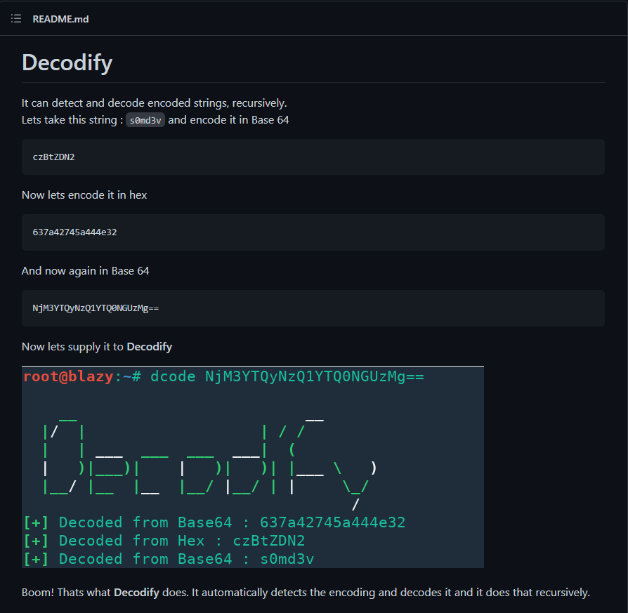
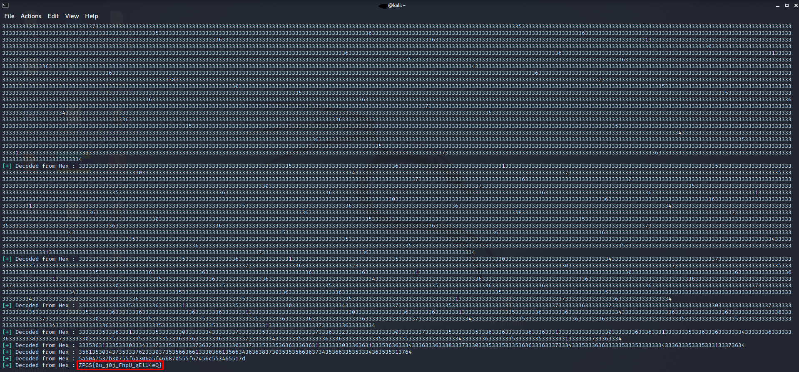
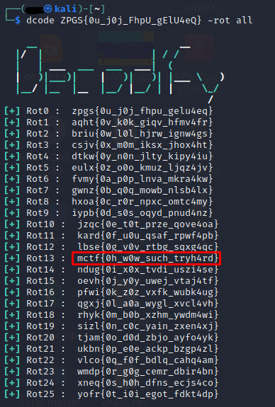

# **Encoded strings**
## <u>**Catégorie**</u>

Misc / Facile

## <u>**Description**</u> :

Nos agents viennent d'intercepter un fichier, néanmoins, ce dernier semble codé. Peu importe à quel point nous essayons, le codage semble persister...  
Passez les différents niveaux de codage et récuperez le flag.  

Format : MCTF{flag}

## <u>**Hints**</u> :

Indice 1 : Tu vas vraiment tout décoder à la main? wow

## <u>**Auteur**</u> :

x

## <u>Solution</u> :

À partir de la consigne, on imagine rapidement un codage récursif. Au lieu de tester tous les types à la main, on va chercher un outil pour faire ça automatiquement.

Après une courte recherche, on tombe sur l'outil "Decofidy" qui semble être capable de décoder des strings de façon récursive. (https://github.com/s0md3v/Decodify)



Une fois l'outil installé, il suffit de lancer le décodage via la commande

```
dcode *string*
```

Après quelques secondes, l'outil nous retourne l'élement racine de ce codage, à savoir ZPGS{0u_j0j_FhpU_gElU4eQ}, ce dernier ressemblant à un flag, on imagine que les lettres sont été décalées.



Il ne nous reste plus qu'à trouver le bon algorithme de chiffrement par décalage.

Pour cela, on va également utiliser decodify avec la commande 

```
dcode ZPGS{0u_j0j_FhpU_gElU4eQ} -rot all
```



Étant donné que Decodify ne fournit que des minuscules, on va devoir rajouter les majuscules dans le flag en se basant sur celles du flag chiffré en ROT :
```
ZPGS{0u_j0j_FhpU_gElU4eQ}
MCTF{0h_w0w_SucH_tRyH4rD}
```

On obtient donc le flag !

**Flag : MCTF{0h_w0w_SucH_tRyH4rD}**
