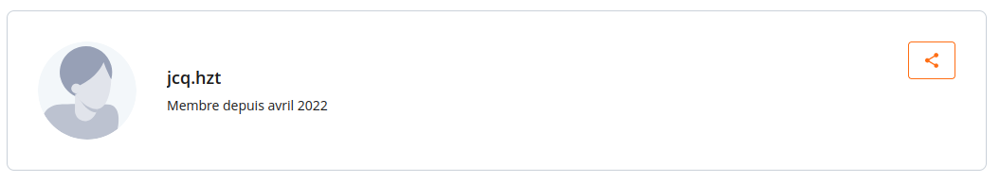
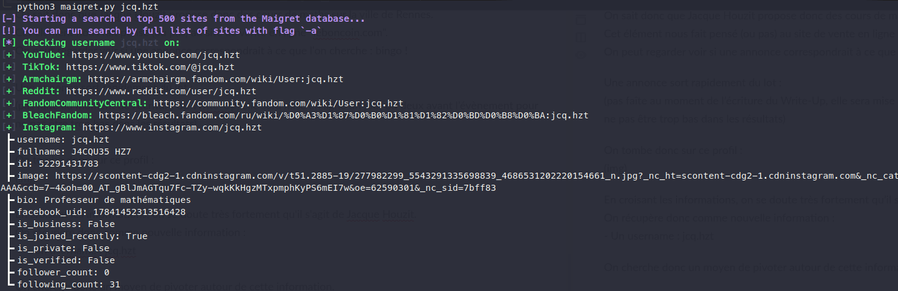
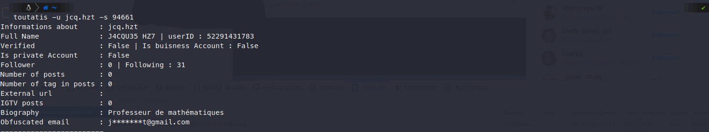

# **T'es dans ta jalousie, je suis dans mon Jacque Houzit 1/3**.
## <u>**Catégorie**</u>

OSINT

## <u>**Description**</u> :

```
Une agence vous mandate pour une nouvelle affaire qu'ils viennent de recevoir.

Vous allez devoir enquêter sur Jacque Houzit, un ancien professeur de mathématiques licencié l'année dernière pour consommation de cannabis sur son lieu de travail.
Il semblerait qu'il ait récemment fait surface. Il est notamment suspecté d'être à la tête d'un réseau de deal à grande échelle dans un village français et d'utiliser différents réseaux sociaux pour en faire la promotion. 
L'agence aurait réussi à obtenir des informations de son côté sur le fait qu'il proposerait des cours de mathématiques à des particuliers sur la ville de Rennes.

Commencez votre enquête et trouvez l'adresse e-mail de Jacque Houzit.

FORMAT DU FLAG : 
MCTF{e-mail}
```
## <u>Hints</u> 

Pas de hint

## <u>Difficulté</u>

Medium
    
## <u>Tentatives</u> 

3 maximum

## <u>Auteur</u> 

Kazuno

## <u>Solution</u> :

Une information importante peut être relevée dans la description :
``L'agence aurait réussi à obtenir des informations de son côté sur le fait qu'il proposerait des cours de mathématiques à des particuliers sur la ville de Rennes.``

On sait donc que Jacque Houzit propose donc des cours de maths sur la ville de Rennes. 

Cet élément nous fait penser (ou pas aha) au site de vente en ligne "leboncoin.fr".
On peut regarder si une annonce correspondrait à ce que l'on cherche.
Une annonce sort rapidement du lot :
(pas faîte au moment de l'écriture du Write-Up, elle sera mise en ligne un jour ou deux avant l’évènement pour ne pas être trop basse dans les résultats)

On peut regarder le profil qui a posté cette annonce :


En croisant les informations, on se doute très fortement qu'il s'agit de Jacque Houzit.
On récupère donc comme nouvelle information :  
	- Un username : **jcq.hzt**

On cherche donc un moyen de pivoter autour de celui-ci.

Qui dit username dit généralement sherlock ou maigret :


Maigret nous renvoie un Instagram (https://www.instagram.com/jcq.hzt/) avec comme bio : 
``
Professeur de mathématiques
``  
Il s'agit bien du compte Instagram de Jacque Houzit.

Il faut maintenant se rappeler de l'énoncé et de ce qui est demandé : il faut retrouver l'email de Jacque Houzit.

Pour avoir des informations sur celle-ci, on peut lancer l'outil toutatis sur le compte Instagram récupéré :


L'adresse email est donc au format j....t@gmail.com
La partie un peu technique de ce challenge est qu'il faut, à partir des infos récupérées, en déduire l'adresse e-mail utilisée.

On peut déjà créer une petite wordlist d'e-mail :
1. jcq.hzt@gmail.com
2. jacque.houzit@gmail.com
3. jacque.hzt@gmail.com
4. jcq.houzit@gmail.com

Le username trouvé précédemment était au format : "jcq.hzt"
On peut donc en déduire trois adresses mail principales en se basant sur ce pattern :
1. jcq.hzt@gmail.com
2. jacque.hzt@gmail.com
3. jcq.houzit@gmail.com

Pour faire les choses bien, on peut vérifier sur ces trois adresses e-mails lesquelles existent vraiment avec des outils en ligne comme par exemple : https://verify-email.org/

Sur les trois adresses, une seule existe :  jacque.hzt@gmail.com


## **Flag : MCTF{jacque.hzt@gmail.com}**
