# **T'es dans ta jalousie, je suis dans mon Jacque Houzit 2/3**.
## <u>**Catégorie**</u>

OSINT

## <u>**Description**</u> :

```
L'agence qui vous a mandaté a elle aussi menée une enquête de son côté. Elle aurait réussi à trouver le nom d'un ami proche de Jacque Houzit, il se nommerait Gilles Parballes.
Continuez leur enquête et essayez de trouver le compte Instagram privé de Jacque Houzit.

FORMAT DU FLAG : 
MCTF{username}
```
## <u>Hints</u> 


## <u>Difficulté</u> 

Easy

## <u>Auteur</u> 

Kazuno

## <u>Solution</u> :


Nous avons comme nouvelle information le nom et prénom d'un ami proche de Jacque Houzit.  
En cherchant ce nom et prénom, on tombe rapidement sur ce compte Twitter :   
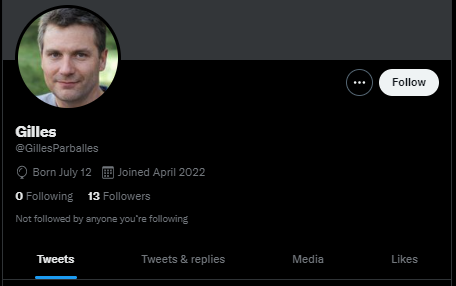

En investiguant sur celui-ci, on trouve deux tweets très intéressants.  
Le premier parlant de l'utilisation de mot de passe faible :  
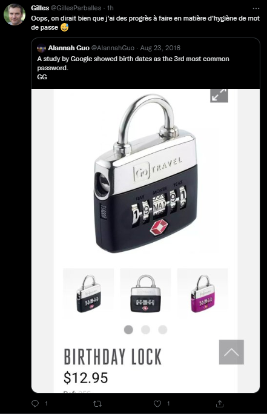

Le tweet parle entre autres de l'utilisation de sa date de naissance comme mot de passe.  
Au vu de la réaction de Gilles, on peut supposer qu'il utilise / qu'il ait utilisé ce format comme mot de passe personnel.

Le deuxième tweet intéressant est celui-ci :  
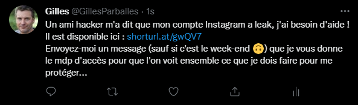

On récupère ici deux informations différentes :
 - Le mot de passe du compte Instagram de Gilles aurait été leak
 - Dans le tweet, il nous fournit un lien menant vers celui-ci mais est apparemment protégé par un mot de passe

En se rendant sur ce lien, on tombe sur un fichier zip partagé via Google Drive. On y trouve à l'intérieur un fichier leak.txt qui pourrait contenir des informations intéressantes.  
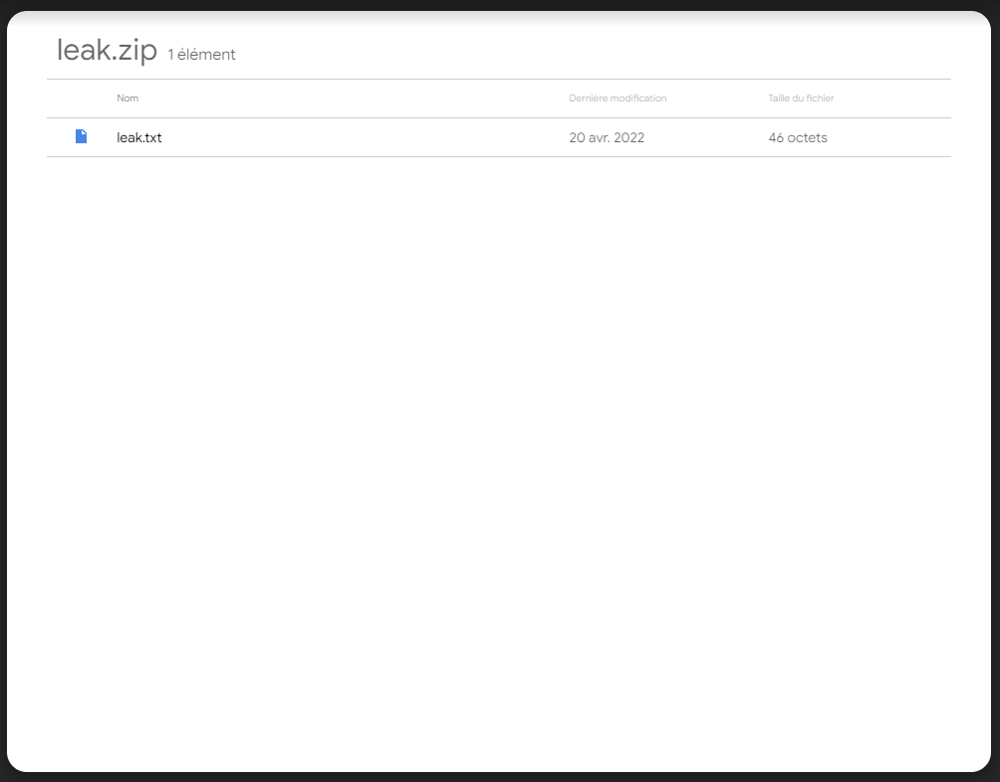  

On télécharge donc le fichier .zip pour l'extraire localement :  
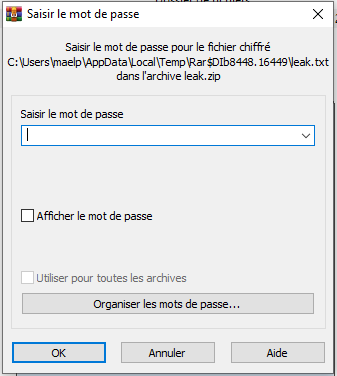  

On est bloqué par le mot de passe mentionné dans le deuxième tweet de Gilles. Il nous faut donc trouver un moyen d'accéder au contenu.  
Nous ne pouvons pas contacter Gilles afin de le SE car il ne répond pas le week-end, dommage ;)  
Par contre, on se souvient la mention d'utilisation de mot de passe faible par Gilles. On pourrait tenter de casser le zip.  

Le jour et le mois de naissance de Gilles est public, il ne nous manque plus qu'à trouver son année de naissance pour potentiellement trouver son mot de passe.  
Sur Twitter, une technique consiste à suivre un compte pour en afficher des informations supplémentaires. On peut essayer de le faire ici :  
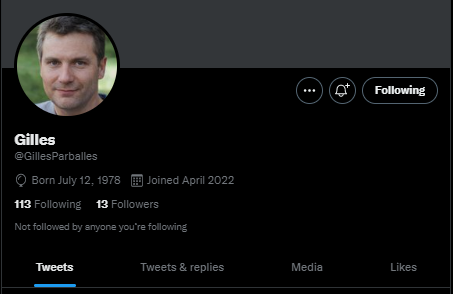

Nous avons maintenant sa date de naissance précise, il est né le 12/07/1978  

Lorsque l'on essaye le mot de passe 12071978 sur le zip, on accède bien au contenu du fichier texte :  
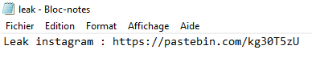

Le fichier leak.txt révèle un lien pastebin avec une combo list de comptes Instagram datant de 2018 et contenant plusieurs usernames et hashs md5.    
  
On peut essayer de localiser l'username appartenant à Gilles pour trouver son compte Instagram.  
En faisant un ctrl+f sur "gilles", un username sort rapidement du lot :  
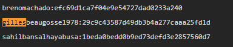

On peut regarder sur Instagram si un compte existe avec cet username. On tombe sur ce profil appartenant bien à Gilles :  
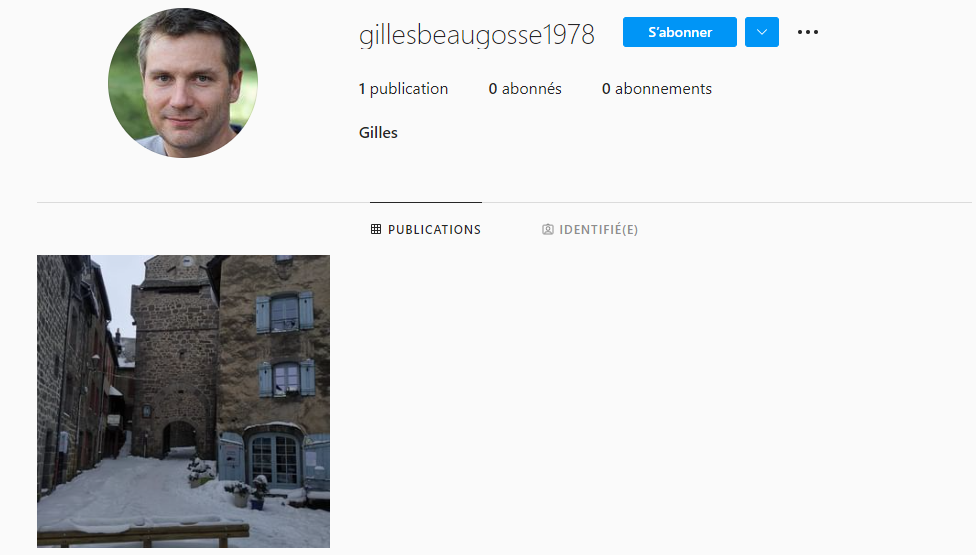

Sur ce compte, il n'y a qu'une seule publication  et on peut y voir un second compte tag dessus :  
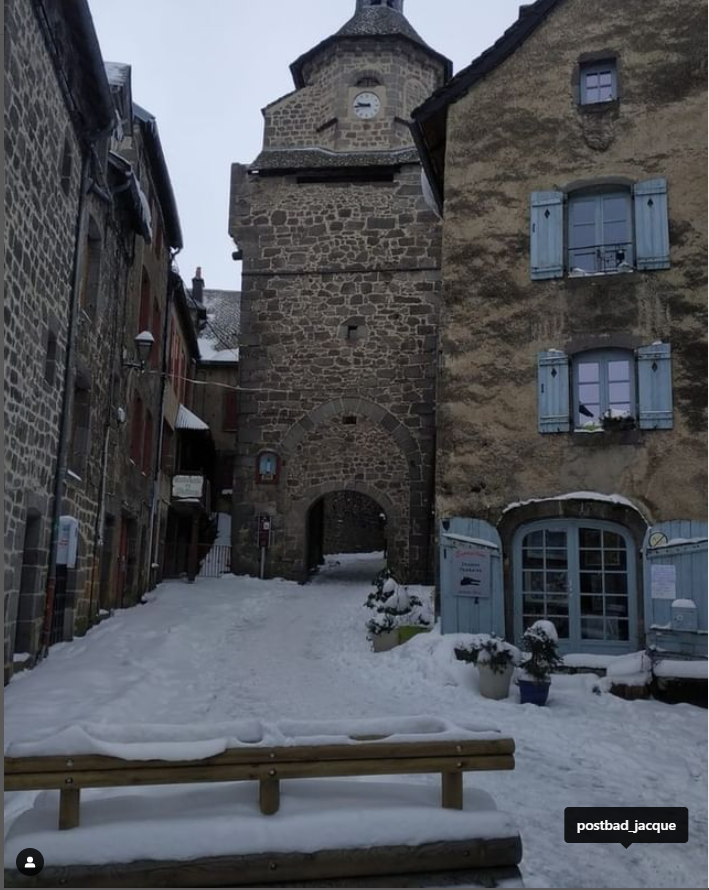

Si on le visite, il semblerait que ce soit bien le compte privé de Jacque Houzit :  
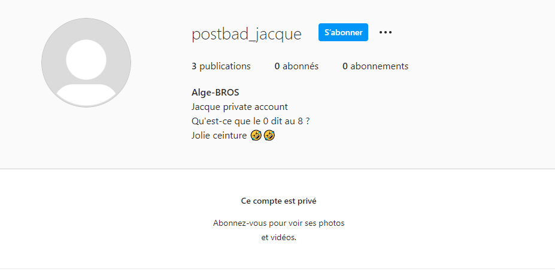

## **Flag : MCTF{postbad_jacque}**
