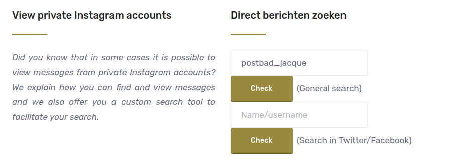
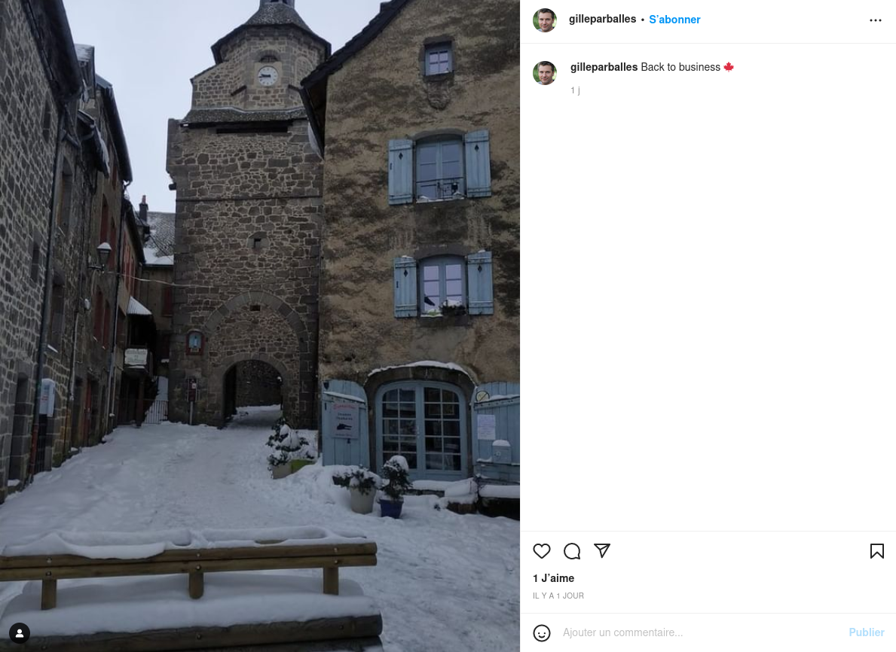
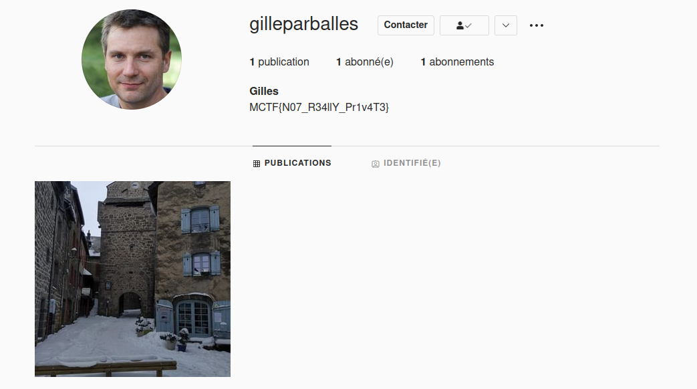

# **T'es dans ta jalousie, je suis dans mon Jacque Houzit 2/3**.
## <u>**Catégorie**</u>

OSINT

## <u>**Description**</u> :

```
L'agence qui vous a mandaté à elle aussi menée une enquête de son côté. Elle aurait réussi à trouver un second compte instagram privé appartenant à Jacque Houzit.
Continuez leur enquête et essayez de trouver des informations reliées à ce compte.

Le compte instagram trouvé par l'agence : postbad_jacque


FORMAT DU FLAG : 
MCTF{}
```
## <u>Hints</u> 

Pas de hint

## <u>Difficulté</u> 

Easy

## <u>Auteur</u> 

Kazuno

## <u>Solution</u> :

Challenge assez simple pour faire la transition avec le dernier challenge de la série.

Nous avons comme information un nouveau compte instagram mais en privé cette fois-ci.
Le but est donc d'essayer de trouver des informations liées à celui-ci.

Le référencement n'ayant pas été fait je ne sais pas si un simple dorking sur "postbad_jacque" suffira pour flag. Toutefois, la solution initiale serait d'utiliser un dork pour essayer de trouver toutes les publications publiques sur instagram ou ce compte aurait été tag .

Deux solutions : 
1. On peut créer le dork à la main
2. On peut utiliser une solution online : https://www.aware-online.com/en/osint-tutorials/view-private-instagram-accounts/

Pour l'exemple on peut utiliser le site afin d'automatiser le process.
Sur le site, on spécifie l'username du compte instagram et on valide :


Évidemment, ici le dork ne renvoie rien car la publication n'a pas encore été référencée.
Dès qu'elle le sera, une publication envoyée par ce compte sera dans les résultats de recherche :


On voit bien que le compte "postbad_jacque" a été identifié, on peut le vérifier en allant visiter son profil et en concordant les informations données dans la description du challenge.

On visite le compte qui a publié la photo et on récupère le flag dans la biographie :

 


## **Flag : MCTF{N07_R34llY_Pr1v4T3}**
