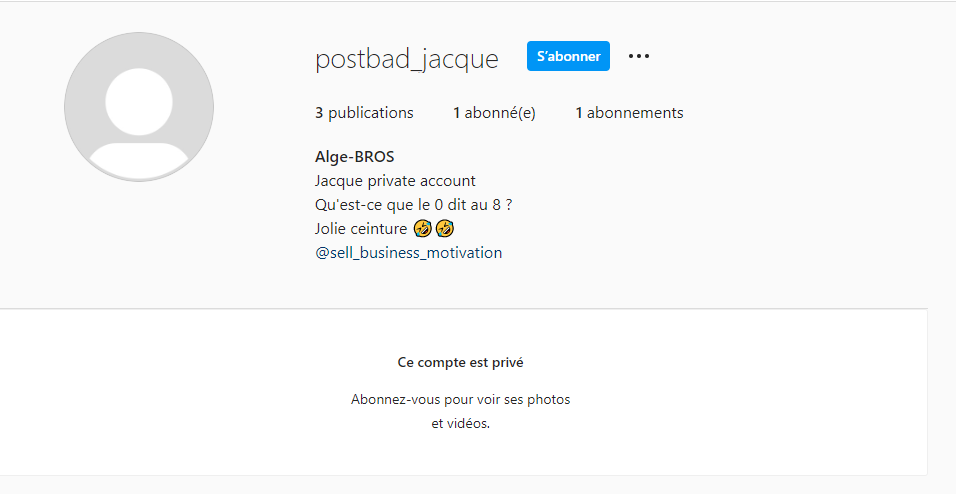
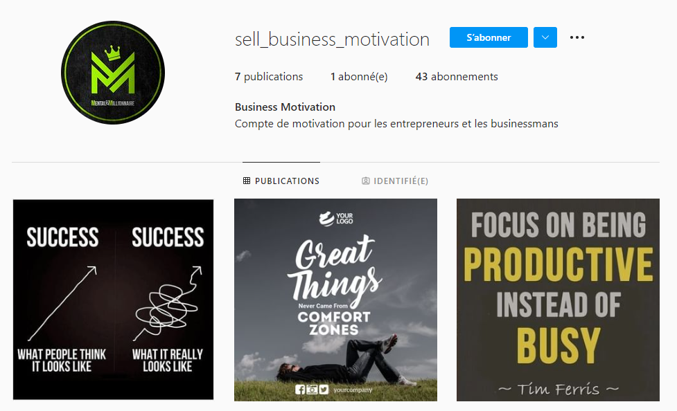
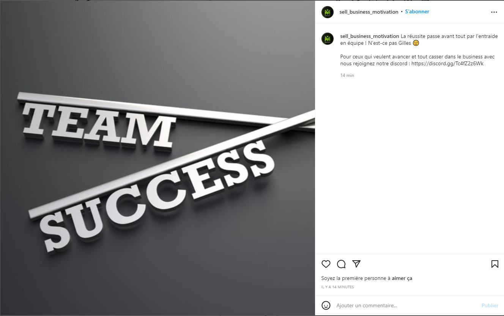
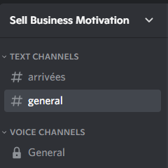
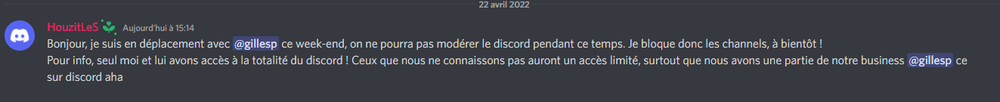
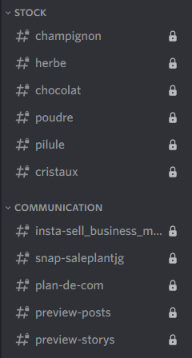
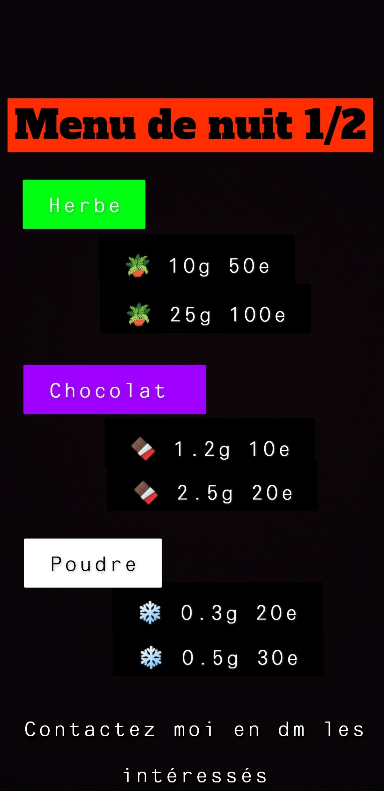
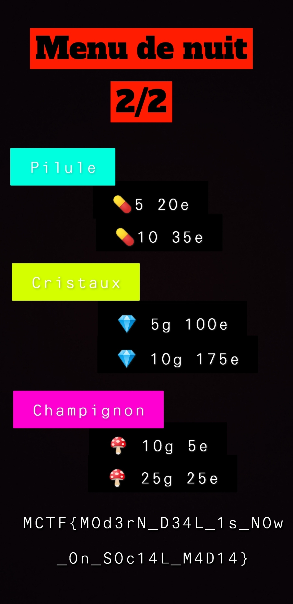

# **T'es dans ta jalousie, je suis dans mon Jacque Houzit 3/3**.
## <u>**Catégorie**</u>

OSINT

## <u>**Description**</u> :

```
L'agence vous demande maintenant de mettre fin à l'activité de Jacque Houzit en l'envoyant derrière les barreaux !
À partir des informations que vous avez réussi à récolter, trouvez la preuve que Jacque Houzit est bien à la tête d'un réseau de deal.

FORMAT DU FLAG : 
MCTF{}
```

## <u>Hints</u> 

Hint n°1 : Discord is better with ?

## <u>Difficulté</u> 

Medium

## <u>Auteur</u> 

Kazuno

## <u>Solution</u> :

La dernière information en date trouvée sur ce challenge était le compte privé de Jacque Houzit.  
Lorsque l'on regarde de plus près, on voit qu'un autre compte Instagram est tag dans sa biographie :  


On voit rapidement qu'il s'agit d'un compte de motivation pour les entrepreneurs :  



En regardant le contenu de celui-ci, une publication saute rapidement aux yeux :  


À partir de ce qui est dit, on se doute qu'il s'agit d'un compte tenu par Jacque Houzit lui-même. On retrouve d'ailleurs son compte privé comme seul abonnement.    
Dans la description de la publication, un lien discord est donné. Des choses intéressantes pourraient s'y retrouver.  
En le rejoignant, on s'aperçoit que nos actions ainsi que les channels sont très limités :  


Cependant, plusieurs informations sont présentes. On retrouve bien Jacque et Gilles (sous des noms différents mais reconnaissables) en tant que "Businessman" du discord.  
Jacque a de son côté laissé un message pour les membres du discord :  


Une partie de leur business est présent sur ce discord ? Tiens donc !  
La partie tricky de ce chall est qu'il faut explorer les channels privés de ce discord avec Better Discord et le plugin ShowHiddenChannels.  
Une fois Better Discord et le plugin setup, de nouvelles informations sont révélées :  


On voit rapidement que le business de Jacque et Gilles tourne bien autour de la vente de produits illicites. L'agence qui nous a mandatés avait bien raison !  
Autre information importante, un compte Snapchat qui servirait à la communication de leur business est mentionné dans un channel : saleplantjg  

Le compte Snapchat existe bien et il possède un profil public avec une story à la une :  



(Une troisième story est disponible avec le flag pour les téléphones qui auraient rogné le flag sur la deuxième story)

Nos soupçons sont confirmés ! Nous avons maintenant une preuve factuelle que Jacque Houzit est bien à la tête d'un réseau de vente de produit illicite.

## **Flag : MCTF{M0d3rN_D34L_1s_N0w_0n_S0c14L_M4D14}**
