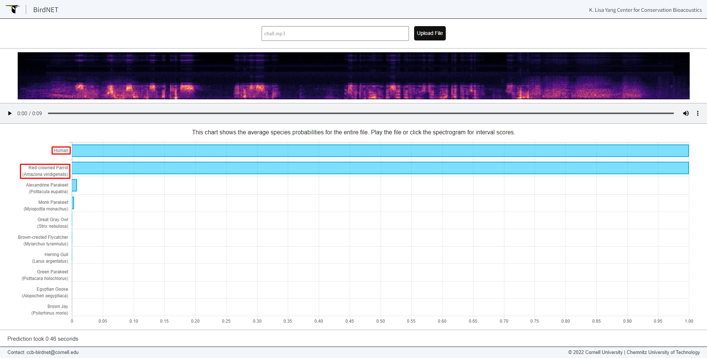

# **Escape route**
## <u>**Catégorie**</u>

OSINT / 

## <u>**Description**</u> :

La cible a réussie à s'enfuir ! Nous n'arrivons plus à retrouver sa trace mais nous avons néanmoins réussi à intercepter une de ses communications. En vous aidant de vos trouvailles précédentes et de cet audio, retrouvez la ville ainsi que le pays dans lequel l'ennemi doit retrouver son contact.

Format : MCTF{ville:pays} (écrit en français)

*Nécessite d'avoir terminé le challenge précédent

## <u>**Difficulté**</u> :

Hard

## <u>**Hints**</u> :

Indice 1 : Ce qu'il dit n'est pas la seule information disponible dans cette bande son..  
Indice 2 : Une information sur son compte twitter pourrait être utile pour éliminer des possibilités...  

## <u>**Auteur**</u> :

x

## <u>Solution</u> :

À la première écoute du fichier, on entend plusieurs informations intéressantes :
- La cible donne rendez-vous à son contact à une ambassade de France, dans une ville inconnue d'un pays inconnu
- On entend en arrière-plan des oiseaux, possiblement caractéristiques du pays.

Nous allons nous focaliser sur la piste des oiseaux.

En faisant des recherches afin de trouver un outil capable d'analyser les chants d'oiseaux, on tombe sur ce site :

https://birdnet.cornell.edu/

On va donc uploader notre message vocal sur le site en espérant une réponse positive

Après quelques secondes d'attente, on obtient un résultat : 

On obtient alors 2 certitudes :  
- La première, et c'est évident, l'analyseur détecte la présence d'un être humain.  
- La seconde confirme la présence d'un oiseau appelé "Red-crowned Parrot (Amazona viridigenalis) soit l'Amazone à joues vertes en français.

Cette information pourrait nous aider à localiser la cible, nous allons donc désormais nous focaliser sur cet oiseau afin d'en tirer des informations. 

Après quelques recherches, on tombe sur une base de données ornithologue (https://avibase.bsc-eoc.org/) qui pourrait nous aider dans nos recherches.

On tombe très rapidement sur la page de l'oiseau en question :

On apprend que cet oiseau est originaire du nord-est du Mexique.

Nous allons désormais dans l'onglet carte afin de voir où peut se trouver cet animal.

On peut aussi le trouver au sein des États-Unis d'Amérique.

La zone de recherche a été fortement réduite, la cible se trouve forcément au Mexique ou sur le sol américain. 

Afin de déterminer plus précisément où pourrait se trouver notre cible, nous avons besoin de plus d'informations. En relisant la description du challenge, on se rend compte qu'il faut aussi se servir de nos trouvailles précédentes.

En retournant fouiller sur le reddit ainsi que sur le twitter de la cible, on tombe sur un tweet qui nous apporte la réponse à notre énigme :

La cible est interdite de territoire américain; le pays dans lequel elle se trouve actuellement est donc le Mexique.

Il ne nous reste donc plus qu'à déterminer à quel endroit se trouver l'ambassade de France au Mexique. 

Pour cela, nous nous rendons sur le site gouvernemental "La France au Mexique" (https://mx.ambafrance.org/-Francais-)

L'adresse est indiquée :

Il n'y a plus qu'à la noter et on obtient le flag.

**Flag : MCTF{Mexico:Mexique}**
