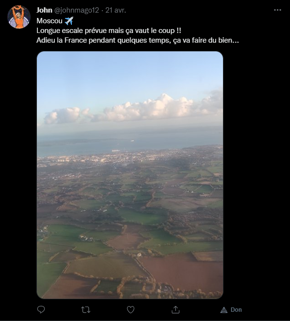
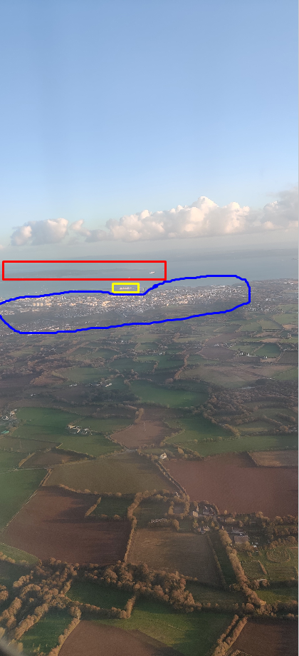
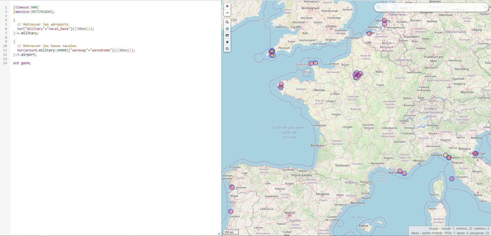
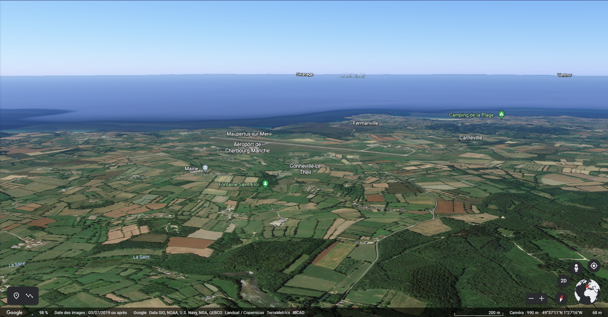
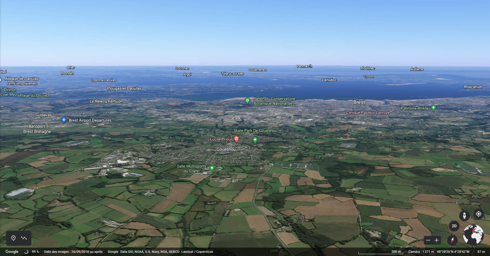
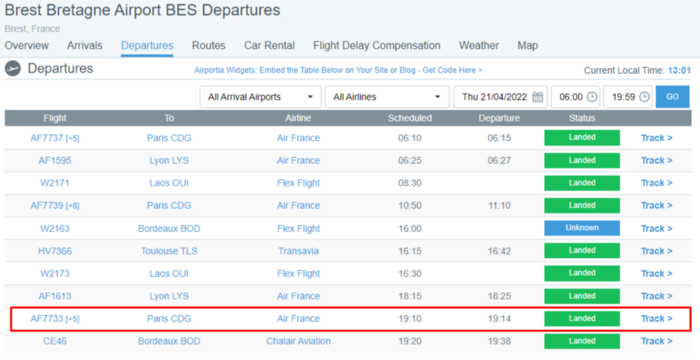

# **From Russia with love**
## <u>**Catégorie**</u>

OSINT / Hard

## <u>**Description**</u> :

Un agent ennemi a été identifié à l'aéroport, malheureusement, à l'exception du fait qu'il a prit un vol commercial, nous n'avons aucune information quant à sa destination...  
La seule information disponible sur cette personne est son reddit : "magojo__", en espérant que son contenu n'a pas été supprimé.  
Retrouvez le numéro de vol de son trajet ainsi que sa destination.  

Format : MCTF{numérodevol:destination}

## <u>**Hints**</u> :

Indice 1 : Il semblerait qu'il n'y ait plus rien sur son reddit. Si seulement on pouvait remonter le temps...  
Indice 2 : Overpass  
Indice 3 : Pour aller à Moscou, il y a forcément une correspondance dans une grande ville connue.  
Indice 4 : Si seulement les avions pouvaient remonter le temps, eux aussi...  

## <u>**Auteur**</u> :

x

## <u>Solution</u> :

On commence avec le reddit de l'utilisateur magojo__ (https://www.reddit.com/user/magojo__)


Le reddit étant vide, on remarque rapidement la mention “time traveler”, faisant penser à la WaybackMachine.

En utilisant cet outil (https://archive.org/web/), on retrouve un post qui nous redirige vers son twitter (https://twitter.com/johnmago12) sur lequel il y a un tweet avec une photo.



À partir de cette photo, qui, d'après le tweet, vient d'être prise, on va essayer de retrouver l'endroit.



- En rouge, on remarque une particularité géographique intéressante qui nous servira plus tard à trier les différents résultats.
- En jaune on remarque un navire militaire, indiquant très probablement une base navale à proximité.
- En bleu on remarque la ville la plus proche, une ville cotière, qui semble donc être la ville dont l'aéroport dépend.

À partir de ces informations, on va utiliser overpass turbo (https://overpass-turbo.eu/) avec le script suivant : 

```// Temps avant que la requête ne timeout
[timeout:900]
// Taille maximum du résultat de la requête (on ajoute une grande valeur afin que le processus ne plante pas)
[maxsize:1073741824];

(
  // Retrouver les bases navales
  nwr["military"="naval_base"]({{bbox}});
)->.military;

(
  // Retrouver les aéroports à moins de 20km de rayon des bases navales
  nwr(around.military:20000)["aeroway"="aerodrome"]({{bbox}});
)->.airport;

out geom;
```

Ce qui donne le résultat suivant : 



Plusieurs résultats apparaissent : 
- 2 près de Brest
- 2 près de Toulon
- 2 près de Cherbourg
- Plusieurs dans la région parisienne

Par logique, on peut directement éliminer ceux dans la région parisienne ainsi que ceux près de Toulon, le décor ne correspondant pas.

On peut aussi éliminer un des deux aéroports de Brest (étant un aéroport militaire) ainsi qu'un des deux de Cherbourg (étant un petit aérodrome alors que nous recherons un aéroport délivrant des vols commerciaux)

Il ne nous reste donc plus qu'à analyser ceux restants.

En premier, l'aéroport de Cherbourg : 



À première vue, l'aéroport ne semble pas correspondre, les caractéristiques géographiques n'étant pas les mêmes.

Puis, l'aéroport de Brest : 



On a trouvé le bon endroit ! Le décor et les particularités géographiques sont les mêmes.

Désormais, il ne nous reste plus qu'à trouver le vol ainsi que la destination.

On sait que notre utilisateur désire se rendre à Moscou, il est donc obligé de passer par Paris depuis Brest, l'aéroport de Brest ne desservant pas les destinations extranationales. On a donc déduit la destination.

La basse altitude de l'avion combinée au fait que nous connaissons sa destination indique un décollage il y a peu.

À partir de la date et de l'heure (Lundi 2 Mai à 11h29), le tout combiné au fait évoqué précédemment, nous allons donc remonter les différents vols effectués depuis Brest.

Bingo ! On peut retrouver l’historique des vols sur Airportia (https://www.airportia.com/france/brest-bretagne-airport/departures/) ou depuis le site de l’aéroport de Brest en utilisant la wayback machine (https://www.brest.aeroport.bzh/departs-et-arrivees)
En indiquant la bonne date, on retrouve un vol qui pourrait correspondre :



Départ à 19h14 vers Paris, ce qui est logique avec la basse altitude et l’heure de la photo. On a donc notre flag.

**Flag : MCTF{AF7733:Paris}**
