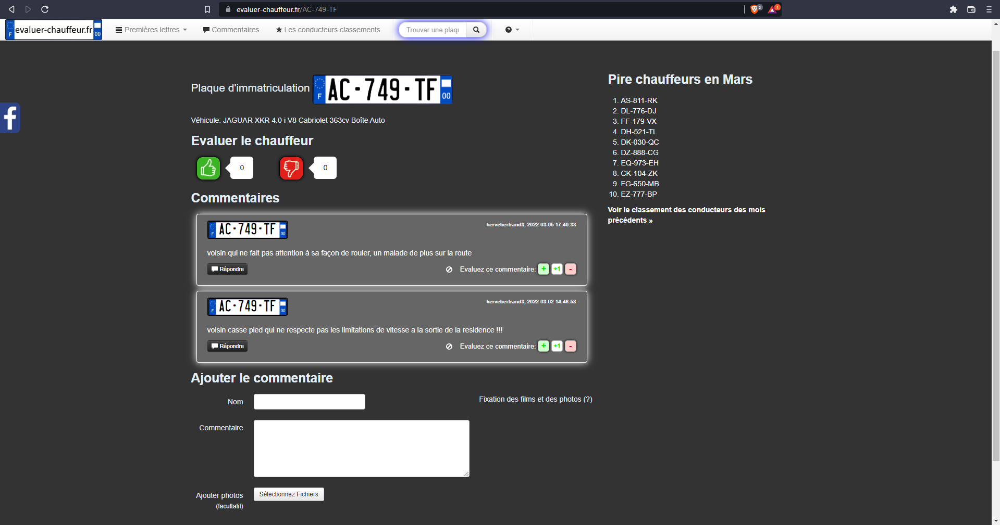
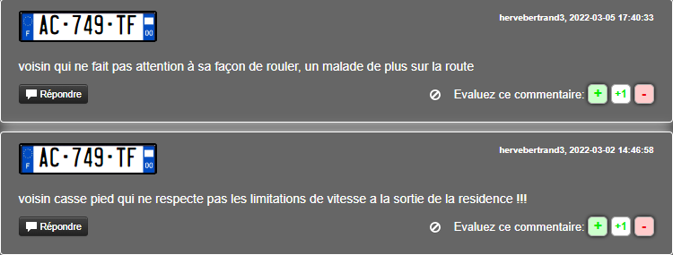
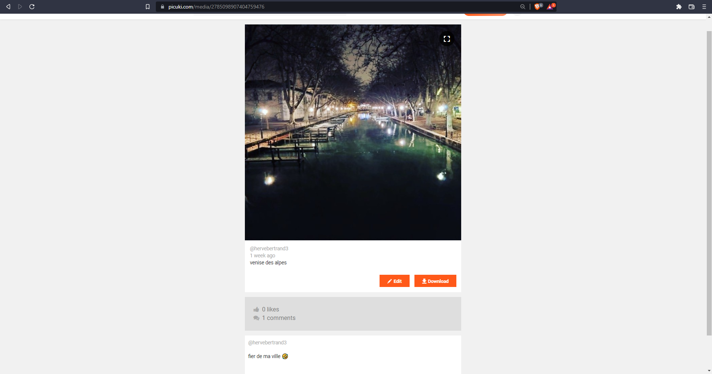
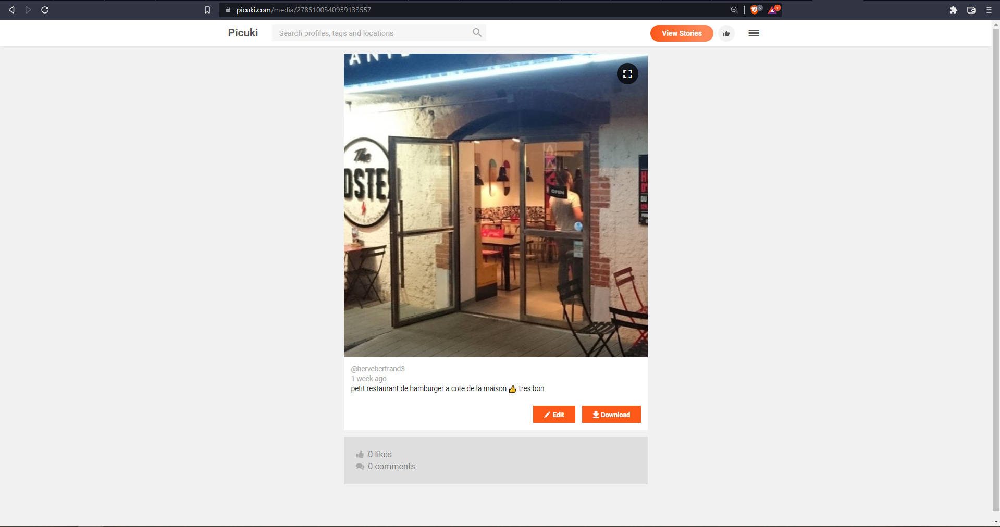
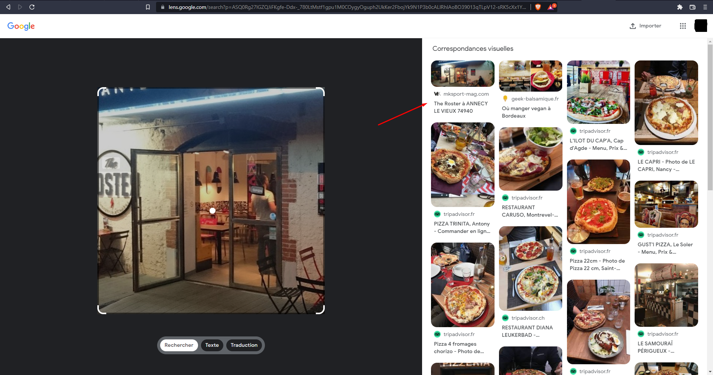
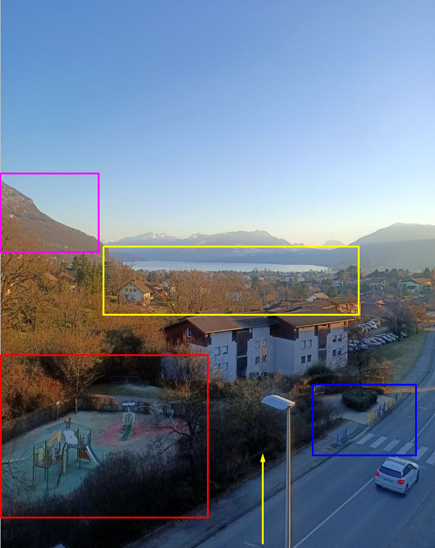
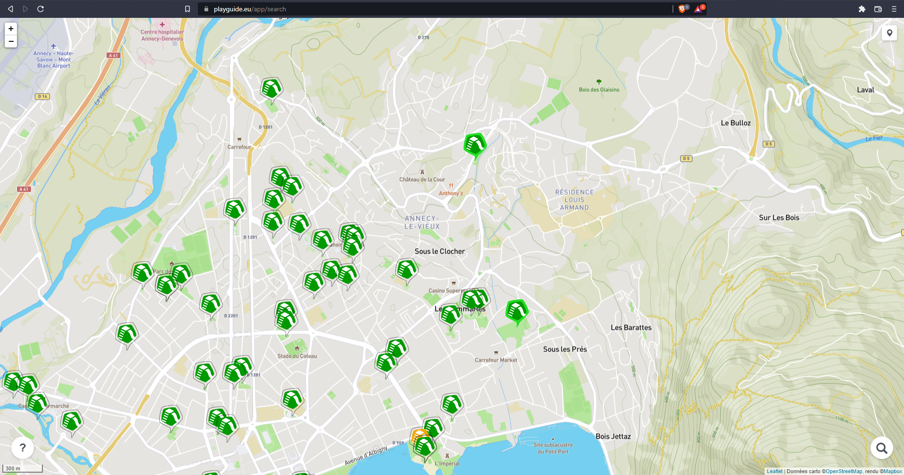
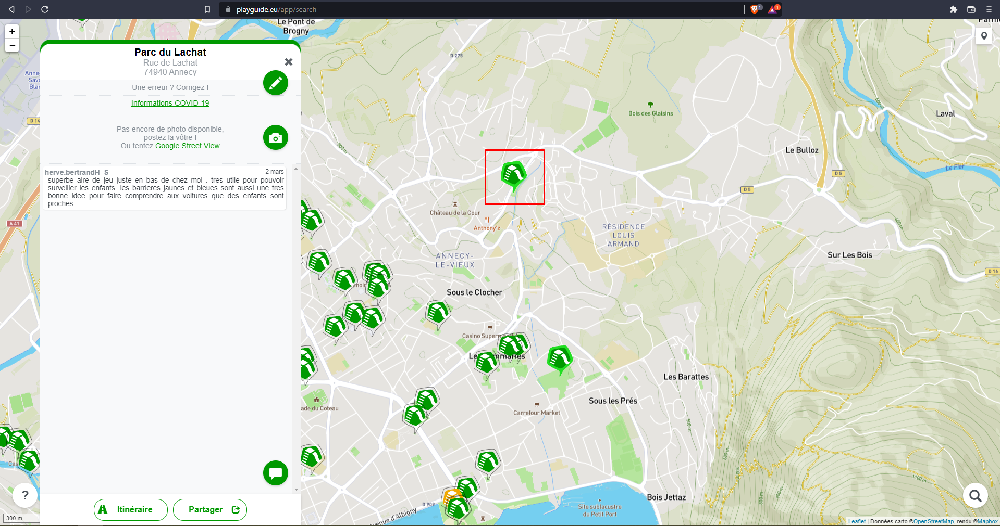

# **Watch your driving**
## <u>**Catégorie**</u>

OSINT / Moyen

## <u>**Description**</u> :

On vient d'apercevoir un agent ennemi s'enfuir ! Malheureusement, nous n'avons pas réussi à l'identifier...  
Tout ce que nous avons en notre possession est sa plaque : "AC-749-TF"  
Votre mission est de retrouver où cette personne réside.  

Format : MCTF{NomDeLaRueEnMD5}

## <u>**Hints**</u> :

Indice 1 : Il paraît qu'il y a un site pour évaluer les chauffeurs.. Avec un peu de chance, quelqu'un a peut-être signalé notre homme...  
Indice 2 : Il devrait y avoir des signes distinctifs sur la photo pour qu'on puisse identifier ce lieu...  

## <u>**Auteur**</u> :

x

## <u>Solution</u> :

On commence directement en recherchant la plaque sur google ou directement sur evaluer-chauffeur.fr

En lisant le commentaire lié à la plaque, on voit que l'utilisateur "hervebertrand3" semble être le voisin de la personne possédant cette plaque

 
On recherche des informations sur ce "hervebertrand3" en utilisant notamment sherlock, whatsmyname, etc.

On tombe sur un instagram qui possède des photos.

Après avoir regardé ses photos, on comprend qu'il réside à Annecy. 

Et plus particulièrement dans une zone proche d'un restaurant qu'il recommande 

Après vérification, le restaurant en question est "Le roster" à Annecy-Le-Vieux.

En regardant de plus près la photo prise depuis son balcon (https://www.instagram.com/p/Camqt7ZMUKX/)

- En rouge, on remarque une aire de jeux pour enfants
- En jaune, on aperçoit le lac et on note que le balcon surplombe la ville
- En bleu, on distingue des barrières de couleurs, servant à signaler l'aire de jeux et possiblement des écoles
- En violet, on discerne la forme de la montagne

À partir de là, on va chercher "aire de jeux annecy" sur google, on tombe très rapidement sur le site "playguide.eu" qui répertorie les aires de jeux pour enfants.

En prenant en compte la position du restaurant "The Roster" à Annecy-Le-Vieux ainsi que les informations géographiques de la photo du balcon, on arrive rapidement à la conclusion que l'aire de jeux en question est le "Parc du Lachat". En se focalisant sur ce dernier on se rend compte qu'il y a un commentaire de... herve.bertrandH_S !

En utilisant Google Earth (ou Maps), on retrouve l'endroit où la photo a été prise (45.92342165250149, 6.146971297952203), le nom de la rue étant "Rue de Lachat"

Chiffré en MD5, le nom de la rue donne b498166a0f83d09f8b975940cf14b95d, on a donc notre flag

**Flag : MCTF{b498166a0f83d09f8b975940cf14b95d}**
