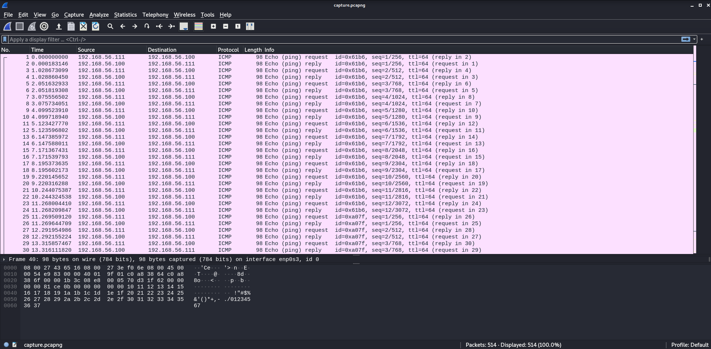
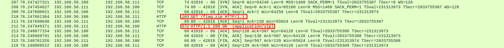
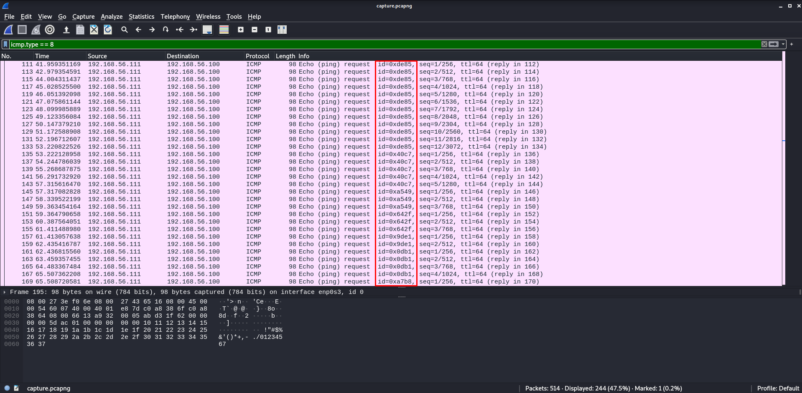
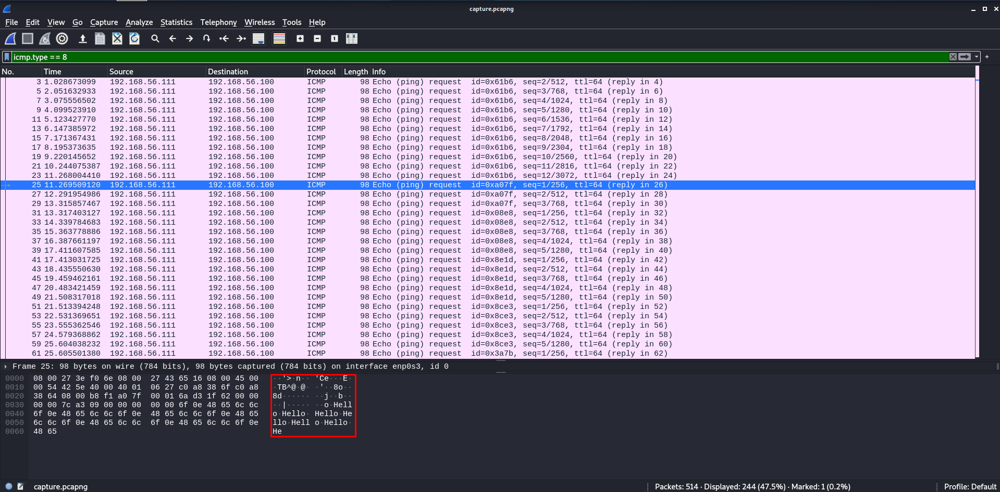
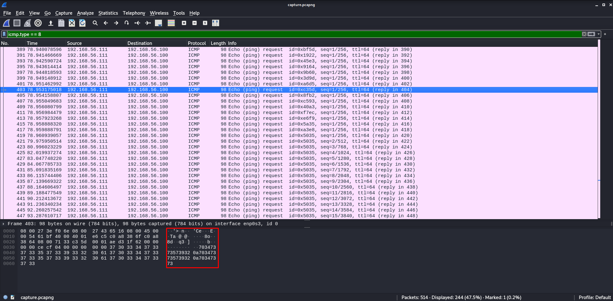
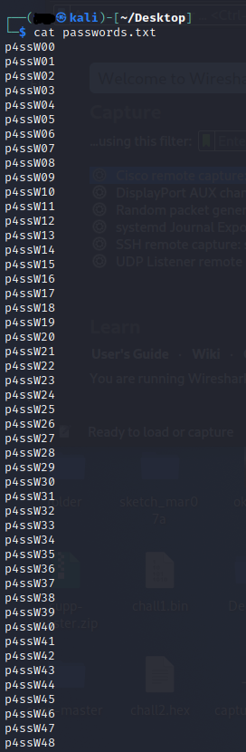
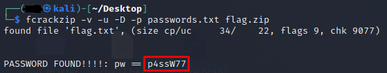

# **Private network isn't safe**
## <u>**Catégorie**</u>

Réseau / Facile

## <u>**Description**</u> :

Nos services ont pu espionner le réseau ennemi. Il semblerait qu'un fichier zip très important ait été envoyé...  
Votre mission est de retrouver le contenu de ce fichier zip.  

Format : MCTF{flag}

## <u>**Hints**</u> :

x

## <u>**Auteur**</u> :

x

## <u>Solution</u> :

Tout d'abord, on commence par ouvrir le wireshark



En parcourant très brièvement la capture, on peut voir que cette dernière est remplie d'ICMP, de quelques échanges TCP et HTTP

Comme nous l'indique le challenge, on remarque très rapidement qu'un zip a été transféré.

On va l'extraire en passant par Fichier -> Exporter Objet -> HTTP (il est aussi possible de l'extraire directement via la commande ```binwalk -e capture.pcapng``` )



Une fois l'archive récupérée, on se rend compte qu'un mot de passe est nécessaire pour l'ouvrir.

On s'intéresse désormais aux requêtes ping, on remarque rapidement que les pings ont des id différents. 

On va donc aller fouiller dans chaque "paquet" d'échange IMCP afin de comprendre pourquoi. (L'envoi et la réponse ayant les mêmes données, on peut filtrer en utilisant icmp.type == 8)



À partir de là, on s'aperçoit vite que de la donnée est envoyée avec les pings.

Certaines requêtes contiennent des mots.



D'autres ce qui semble être du texte en hex.



En remontant les requêtes peu à peu, on obtient les phrases suivantes :

```
Hello Are You Looking For A Password? Here It Is : 
```

On comprend alors que le texte qui suit ces phrases sont en fait des mots de passe.

On récupère les mots de passe, puis on les convertit en string et on créé une wordlist afin d'ouvrir le zip.

Pour cela, deux choix :
- Soit y aller à la main
- Soit utiliser tshark pour tout faire d'un coup via la commande 
```
tshark -2 -r capture.pcapng -Y icmp -R 'ip.src == 192.168.56.111 && data.data contains "7357"' -T fields -e data.data | cut -c 17-48 | xxd -r -p | xxd -r -p > passwords.txt
``` 
Cette commande a pour effet de retrouver la data commencant par 7357 (soit tous les mots de passe) transmis par l'IP source 192.168.56.111, de les couper, de les convertir en ASCII et de les placer dans un fichier qui nous servira de wordlist.



On peut exploiter notre wordlist précédemment créé avec l'outil fcrackzip via la commande 
```
fcrackzip -v -u -D -p passwords.txt flag.zip
```

Une fois le zip cracké, on retrouve le mot de passe "p4ssW77"



Il ne nous reste plus qu'à ouvrir l'archive et retrouver le flag.

**Flag : MCTF{p4ck37_an4LyZ3r}**
