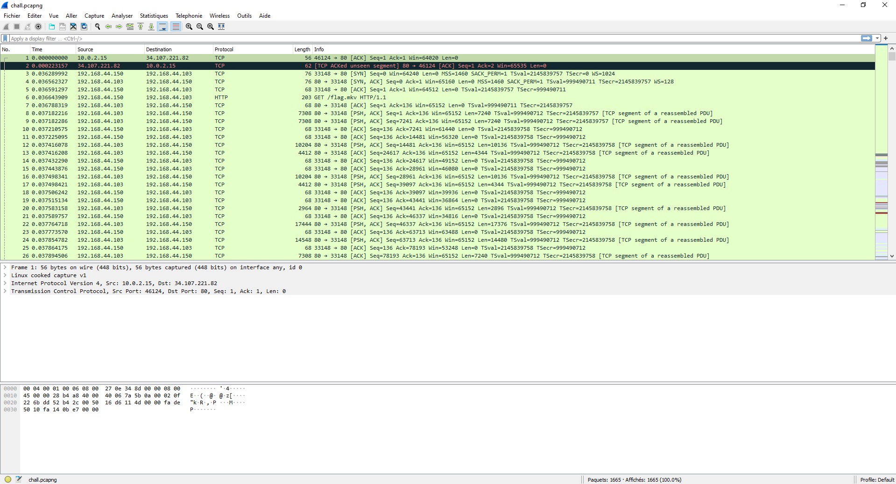
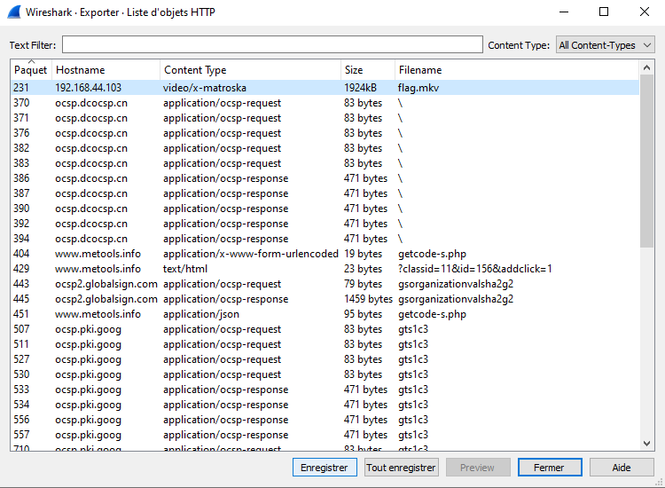
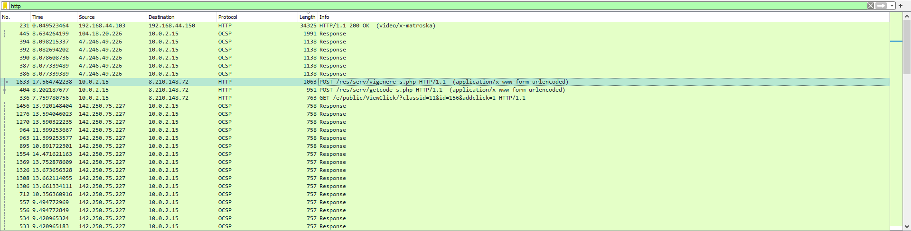
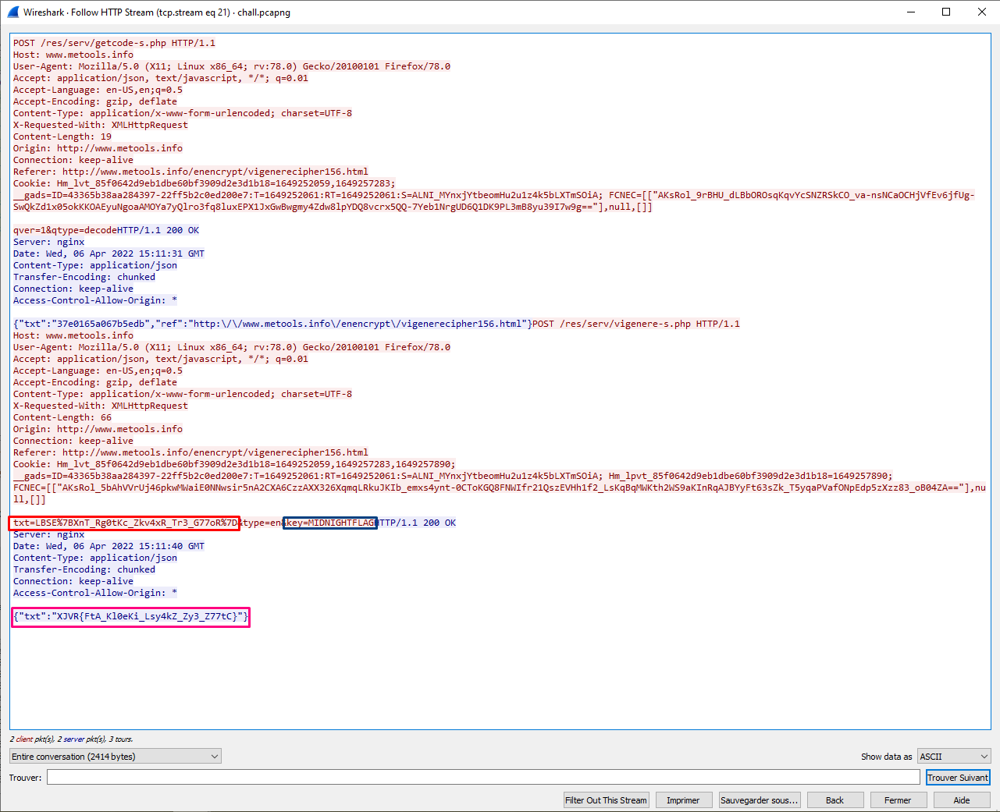
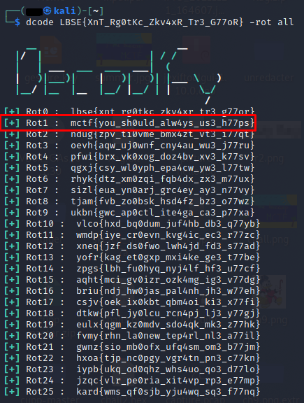

# **Unencrypted communication**
## <u>**Catégorie**</u>

Réseau / Facile

## <u>**Description**</u> :


Nous avons intercepté des communications ennemies, il semblerait que certains informations importantes aient transitées en clair.
Retrouvez le flag.

Format : MCTF{flag}

## <u>**Hints**</u> :

x

## <u>**Auteur**</u> :

x

## <u>Solution</u> :


Tout d'abord, on commence par ouvrir le wireshark



En parcourant très brièvement la capture, on remarque qu'il a énormément de paquets. On va donc inspecter la hiérarchie des protocoles via :
```
Statistiques -> Hiérarchie des protocoles
```


On remarque qu'il y a du HTTP et que quelque chose de lourd semble avoir été envoyé.

On va donc extraire ce fichier en passant par Fichier -> Exporter Objet -> HTTP (il est aussi possible de l'extraire directement via la commande binwalk -e chall.pcapng )



On va désormais ouvrir la vidéo 


Loupé ! C'était une fausse information.

Malgré tout, et en se basant sur la description du challenge, on va finir de fouiller les requêtes HTTP avant de passer aux autres protocoles.

On remarque rapidement une requête POST menant vers un fichier "vigenere-s.php". 



La présence d'une requête POST indique que des données ont été envoyées au serveur par l'utilisateur

On va donc suivre le flux de cette requête via 
```
Suivre -> HTTP Stream
```



Ici, on remarque plusieurs choses :  
- En rouge on voit le texte que l'utilisateur a voulu chiffrer en vigenere  
- En bleu, on remarque la clé qu'il a voulu utiliser pour le chiffrement  
- En violet, on aperçoit le résultat de ce chiffrement

Étant donné que ces chaînes de caractères ressemblent très clairement à des flags, on sait désormais qu'on est sur la bonne piste.

À partir de là il y a 2 façons d'agir :  
- On peut faire l'opération inverse en utilisant le texte codé en vigenere ainsi que la clé pour décoder le message : ```LBSE{XnT_Rg0tKc_Zkv4xR_Tr3_G77oR}```
- On peut également prendre ```LBSE%7BXnT_Rg0tKc_Zkv4xR_Tr3_G77oR%7D``` et remplacer le code Hex des accolades pour obtenir ```LBSE{XnT_Rg0tKc_Zkv4xR_Tr3_G77oR}```

On a désormais un flag qui semble chiffré en ROT.

Étant donné qu'on ne connaît pas le degré de décalage, on va donc utiliser l'outil Decodify afin d'automatiquement déchiffrer cette chaîne de caractère via la commande :

```
dcode LBSE{XnT_Rg0tKc_Zkv4xR_Tr3_G77oR} -rot all
```



Étant donné que Decodify ne fournit que des minuscules, on va devoir rajouter les majuscules dans le flag en se basant sur celles du flag chiffré en ROT :
```
LBSE{XnT_Rg0tKc_Zkv4xR_Tr3_G77oR}
MCTF{YoU_Sh0uLd_AlW4yS_Us3_H77pS}
```

On obtient donc le flag !

**Flag : MCTF{YoU_Sh0uLd_AlW4yS_Us3_H77pS}**
