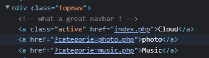
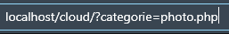
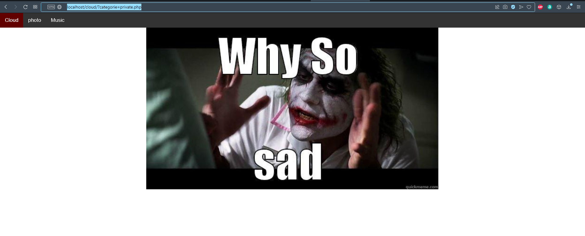
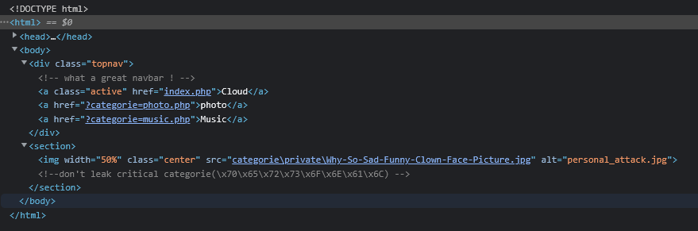
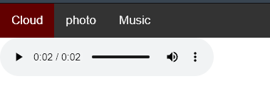
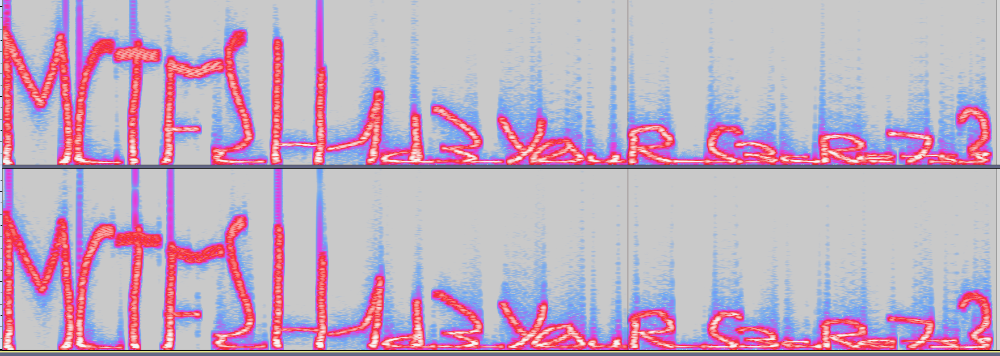

# **To be private or not to be private ?**.
## <u>**Catégorie**</u>

Stéganographie

## <u>**Description**</u> :

Au sein de vos locaux un employé vous semble suspicieux et pourrait envoyé des informations importante à une organisation, vous savez qu'il utilise souvent un cloud est ce que tout cela est lié ?

FORMAT DU FLAG : MCTF{flag}

## <u>Hints</u> 

## <u>Auteur</u> 

Spownark 

## <u>Solution</u> :
En arrivant sur le site on peut voir qu'il s'agit d'un cloud réaliser par une personne, en regardant le code source du site on peut voir que la personne a laissé un commentaire sur ça barre de navigation étant fier de ce qu'il à fait.

Lorsque l'on clique sur l'un des 2 boutons sur la barre de navigation (Photo et Music) on voit dans l'URL qu'un paramètre nommais "categorie" est affiché et que celui-ci prend en valeur les page pour les afficher.

En voyant le nom du chall la personne va essayer de mettre (cloud/?categorie=private.php) ce qui va lui retourner cette page :

Cette page n'est pas la que pour troller le joueur car si elle va dans le code source elle pourra voir ce commentaire.

en effet il y a bien un message laissé par inadvertance "don't leak (\x70\x65\x72\x73\x6F\x6E\x61\x6C)" celui ci est chiffré en hexa il suffit d'aller sur dcode pour le déchiffrer et on obtient "personal" il suffit de mettre dans l'URL (cloud/?categorie=personal.php) ce qui nous affiche cette page.

On obtient un fichier audio qui est téléchargable en l'écoutant le son parait étrange il suffit de l'ouvrir dans audacity pui d'activer le spectogramme et de mettre dans le bon sens la piste et on obtient le flag :

##**Flag : MCTF{h1d3_Y0uR_S3cRe7s}**
