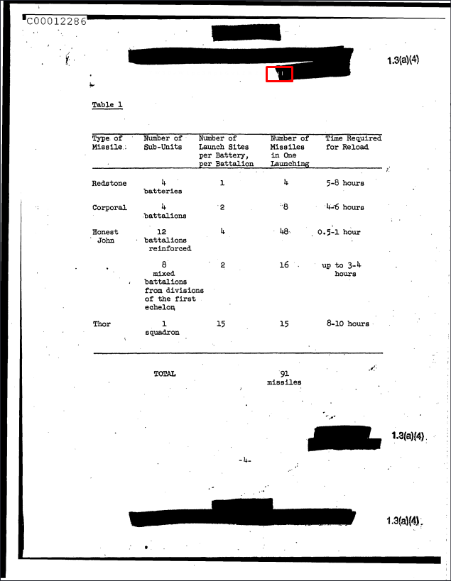
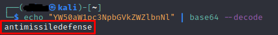

# **Nothing is classified**
## <u>**Catégorie**</u>

Stéganographie / Facile

## <u>**Description**</u> :

Un de nos agent a trouvé un fichier classifié sur un des ordinateurs d'un camp ennemi.  
Examinez ce fichier et trouvez le secret qu'il renferme.  
Format : MCTF{flag}

## <u>**Hints**</u> :

Indice 1 : D'après nos experts, il est possible d'un fichier soit caché à l'intérieur de cette image...

## <u>**Auteur**</u> :

x

## <u>Solution</u> :

La première vérification consiste à faire une des choses les plus courantes en matière de stéganographie : vérifier le type de fichier 

```
file classified.pdf
```


On comprend désormais que le fichier est originalement un fichier .jpeg qui a été renommé en .pdf, il suffit donc de lui rendre son extension de base.

Puis, en ouvrant et en observant l'image, on remarque assez rapidement des caractères qui semblent être mal censurés.



En jouant un peu avec les niveaux de couleur sur un outil de design ou via des outils en ligne (gimp/photoshop/fotoforensic...), on peut faire apparaître la chaîne de caractères en entier.


Après une rapide analyse, on comprend que c'est une chaîne en base64, on va donc la décoder via la commande 
```
echo YW50aW1pc3NpbGVkZWZlbnNl | base64 --decode
```


Nous avons désormais un mot de passe ainsi qu'une image, on imagine donc qu'il y a quelque chose de caché à l'intérieur de cette dernière. 

Il suffit désormais d'utiliser la commande
```
steghide extract -sf classified.jpg
```
avec
```
antimissiledefense
```
comme clé


La dernière étape consiste à lire le fichier flag.txt
```
cat flag.txt
```

Et on obtient le flag

**Flag : MCTF{cL@$Sif1eD_D0cUm3N7}**
