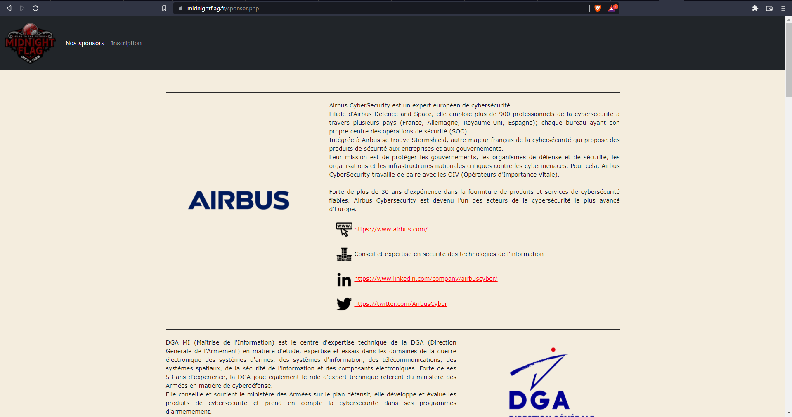
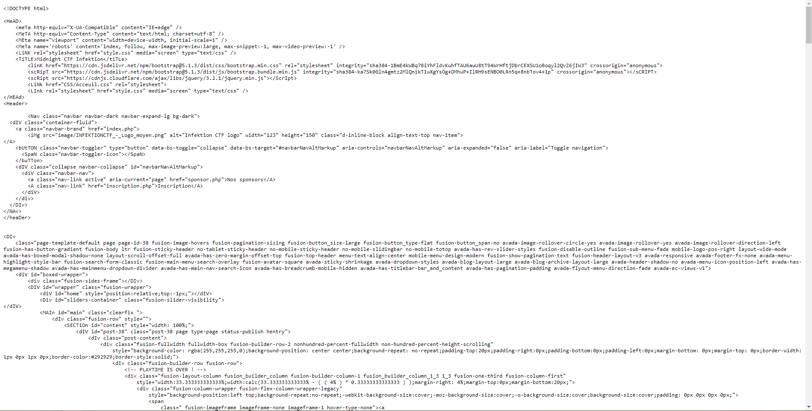
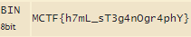

# **sPoNs0r PaGe**
## <u>**Catégorie**</u>

Stéganographie / Facile

## <u>**Description**</u> :

Il semblerait qu'un pirate se soit amusé à cacher une information sur le site midnightflag.fr, mais nous n'arrivons pas à trouver où ni comment il a bien pu faire ça...

Format : MCTF{flag}

## <u>**Hints**</u> :

Indice 1 : Pourquoi ce mélange de majuscules et de miniscules dans les balises?

## <u>**Auteur**</u> :

x

## <u>Solution</u> :

En lisant le titre du challenge, on remarque tout de suite l'écriture très singulière employée. Cela pourrait potentiellement indiquer que la typographie est une des clés pour résoudre cette épreuve.

On se rend donc sur le site MidnightFlag et plus particulièrement sur la page des sponsors (endroit déduit à l'aide du titre).



À première vue, pas de soucis sur la page. On va donc fouiller le code source



On se rend rapidement compte que certaines balises sont écrites d'une façon particulière, alliant majuscules et minuscules.


En recherchant des informations, on tombe sur un article très intéressant (https://www.researchgate.net/figure/Stego-Html-source-after-embedding-the-secret-message_fig2_45909979). La documentation nous permet de comprendre qu'il faut qu'il faut concaténer ces balises puis les traduire en binaire (0 pour une majuscule, 1 pour une minuscule).

Après avoir supprimé le texte, concaténé les balises et converti ces dernières en binaire, on obtient ce résultat :

```
HeADmeTaMeTAMEtaMeTaLiNKTiTLEtiTLelinKscRipTsCRIPTscRiptScrIptLiNkLInkHEAdHeaderNavdIVaiMgAbUtTONSpaNSpaNbuTTondIVdiVaAAAdiVdivDIvNAvheaDerDIvdiVdivDIvDIVdiVdIVDivdIVMAIndIvSECTiOndIVdIvdivdIv
010011010100001101010100010001100111101101101000001101110110110101001100010111110111001101010100001100110110011100110100011011100100111101100111011100100011010001110000011010000101100101111101
```

Il ne nous reste plus qu'à convertir le binaire en ASCII pour obtenir le flag : 



**Flag : MCTF{h7mL_sT3g4nOgr4phY}**