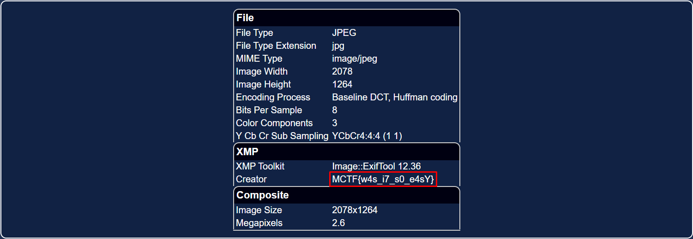
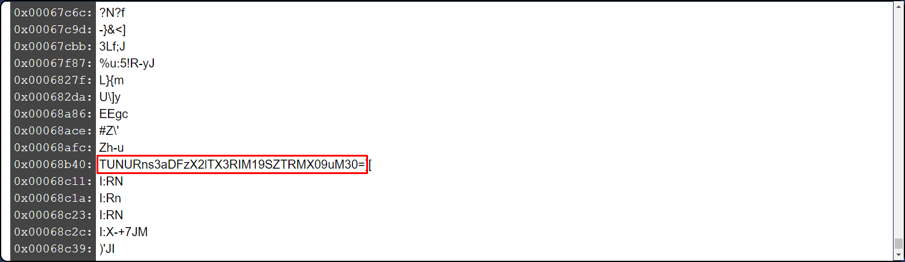
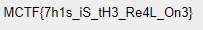
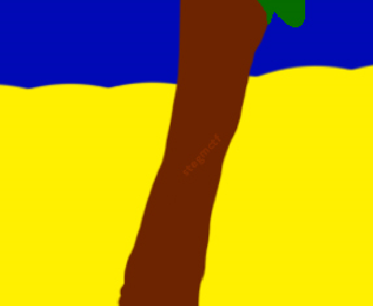
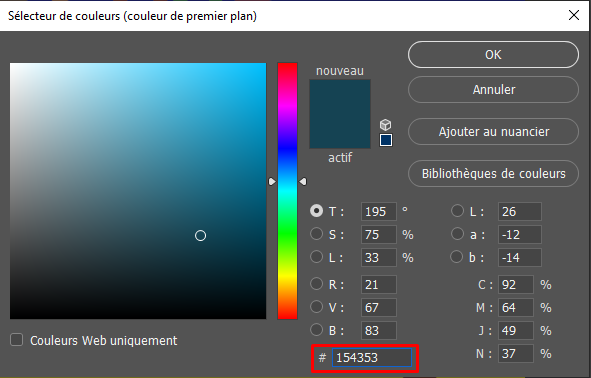

# **Summer is beautiful**
## <u>**Catégorie**</u>

Stéganographie / Moyen

## <u>**Description**</u> :

Ah, l'été ! Quelle magnifique saison... on l'aime pour ses paysages, pour ses couleurs...

Format : MCTF{flag}

## <u>**Hints**</u> :

Indice 1 : Il semblerait que tous ces flags soient des faux... Le flag est pourtant bien présent sur l'image...

## <u>**Auteur**</u> :

x

## <u>Solution</u> :

Le chall contient plusieurs faux flags (qu'on peut trouver facilement via aperisolve (https://aperisolve.fr/) ou fotoforensics (https://fotoforensics.com/) ):
- Un faux flag est présent dans l'exif du fichier

- Un autre est présent dans les strings de l'image (encodé en Base64)


- Le dernier est présent sur un des palmiers dans l'image.



Le scénario du challenge ainsi que toutes ces couleurs différentes sur le texte nous oriente vers la possibilité qu'un texte soit caché à l'intérieur de ces dernières.

Les couleurs étant très particulières et n'ayant pas vraiment de sens, on s'intéresse donc au code couleur de ces dernières. En relevant chaque couleur sur chaque lettre via la pipette de n'importe quel outil de manipulation d'images, on vient relever les deux dernières valeurs hexadécimales de chaque couleur.



Ainsi, en relevant le dernier octet de chaque couleur présente sur le texte de l'image, on obtient : "4D 43 54 46 7B 52 34 69 4E 62 30 57 5F 46 6C 34 47 21 7D"

Il ne nous reste plus qu'à traduire les caractères récupérés en ascii via la commande
```
echo -e "\x4D\x43\x54\x46\x7b\x52\x34\x69\x4e\x62\x30\x57\x5f\x46\x6c\x34\x47\x21\x7d"
```


**Flag : MCTF{R4iNb0W_Fl4G!}**
