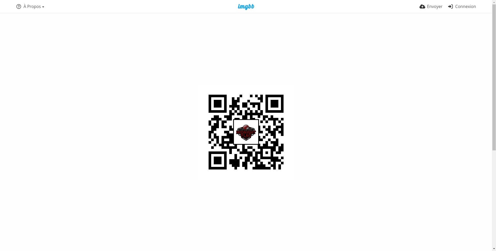
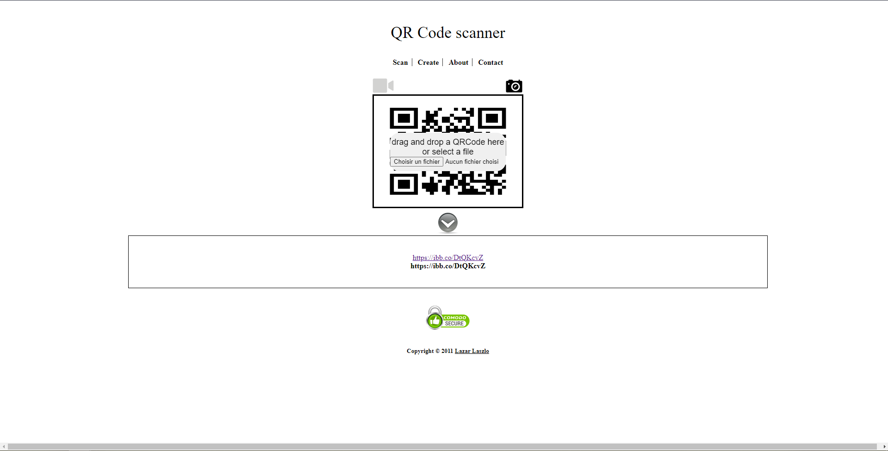
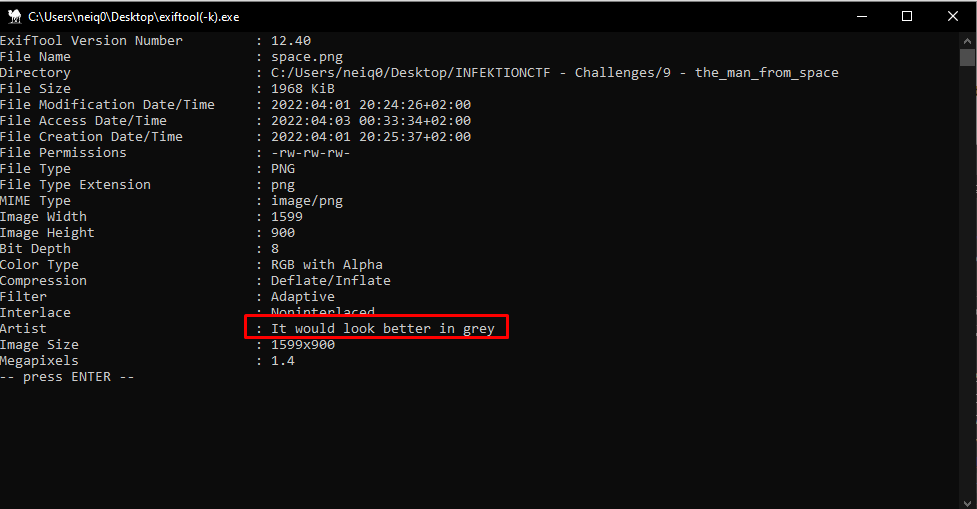
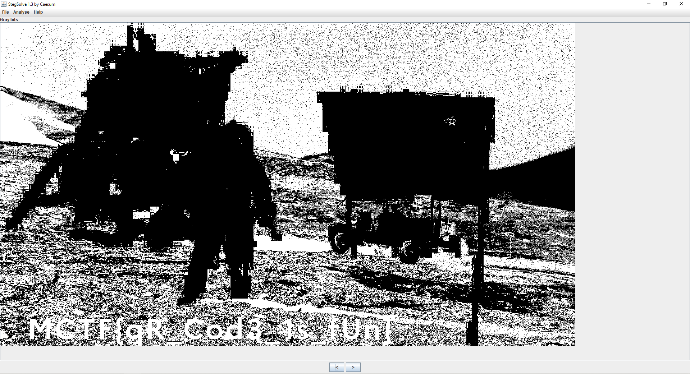

# **The man from space**
## <u>**Catégorie**</u>

Stéganographie / Facile

## <u>**Description**</u> :

Mｅrcｉ pοｕr touｓ νｏｓ
retοｕrs ｓur lｅ ｔraⅰleｒ ! 
Sі vοuｓ ne
ｌ＇ａνeｚ pａs ｅｎｃore
ｖu, ｆonｃｅｚ ！ Ｎ'ｈésⅰteｚ pas non plus à rejoindre notre discord :)

Trailer : https://www.youtube.com/watch?v=H_FT7KB74KU  
Discord : https://discord.com/invite/jDkScvpq6s

## <u>**Hints**</u> :

x

## <u>**Auteur**</u> :

x

## <u>Solution</u> :

On remarque un problème d'encodage sur la première moitié du tweet; problème qui s'arrête soudainement. On pense alors à un message caché.

Après quelques recherches, on tombe rapidement sur un site permettant de cacher un message secret dans un tweet : https://holloway.nz/steg/


Il y a effectivement un message caché, un lien, plus précisément ! 

En suivant ce lien, on tombe sur un site d'hébergement d'image qui héberge alors un QR code :



On peut utiliser un service en ligne ou son téléphone afin de consulter les informations contenues dans ce QR code, de notre côté, nous allons utiliser https://webqr.com/



Un nouveau lien se présente à nous.

En consultant ce lien, on tombe à nouveau sur un site d'hébergement d'image.


Une fois ce fichier téléchargé, on va jeter un oeil aux métadonnées 



On y trouve une phrase inscrite :

```
It would look better in grey
```

On comprend donc qu'il va falloir jouer avec les couleurs et notamment avec les nuances de gris pour trouver le message caché.

On ouvre alors stegsolve qu'on positionne sur "gray bits"



Le flag apparaît !  

**Flag : MCTF{qR_Cod3_1s_fUn}**