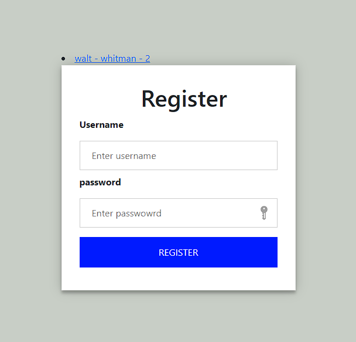
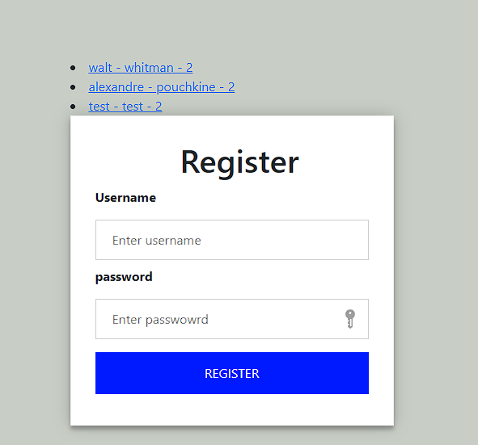
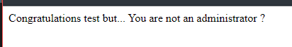
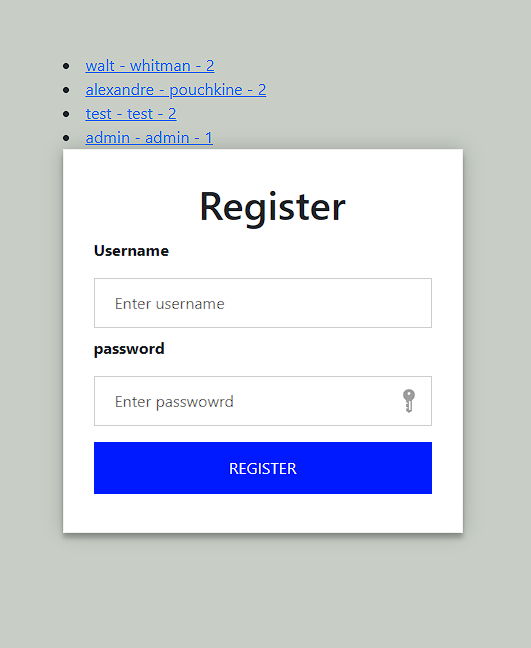
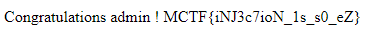

# **craft_it_yourself**.
## <u>**Catégorie**</u>

Web / Easy

## <u>**Description**</u> :

DESCRIPTION DU CHALL

Une plateforme ennemie a été découverte récemment. On pense qu'ils cachent des documents confidentiels tels que leurs plans d'attaque. Tenter tout ce qui est en votre capacité pour accéder à ses données. 

Format : MCTF{flag}

## <u>Hints</u> 

Indice 1 : Connaissez vous SQL ? 
Indice 2 : Ca serait bien si on avait un compte administrateur sous la main...

## <u>Auteur</u> 

Arathor

## <u>Solution</u> :

On arrive sur une page d'inscription, on sait que le challenge a un lien a la base de données et donc au SQL. 

Saisir un username et password nous permet de voir qu'une requête s'effectue bien vers la base de données. 
Quelques essais permet de connaître rapidement le nom de la table et une rapide requête nous permet d'afficher l'un des users de la bdd :

        ?user=1 
         

        ?user=1 OR 1 pour afficher tous les champs de la table.
        

On peut voir que le user saisit dans le formulaire c'est rajouter dans la base de données !
Se connecter avec l'un de ses comptes nous permet de rapidement comprendre l'objectif.
        
        

On comprend qu'il faut un utilisateur admin pour pouvoir se connecter. Grâce à l'affichage des données on constate un int comme 3ème champs de la table user qui correspond à son rang qui ici est 2. 
Un utilisateur rang 1 est considéré comme administrateur par le système.

        ?username=admin', 'admin', 1)%23&password=test

Cette requête dans l'url permet d'injecter un utilisateur avec admin et admin comme couple username/password mais surtout avec le rang 1.
Vous obtiendrez des erreurs, c'est normal l'injection fait planter la vérification anti-doublons sur les username.
Si on réutilise la requête pour afficher les enregistrements de la base on constate que l'utilisateur a bel et bien été ajouté.

        

Si vous vous connectez avec le compte rang 1 vous obtiendrez le flag !

        

**Flag : MCTF{iNJ3c7ioN_1s_s0_eZ}**